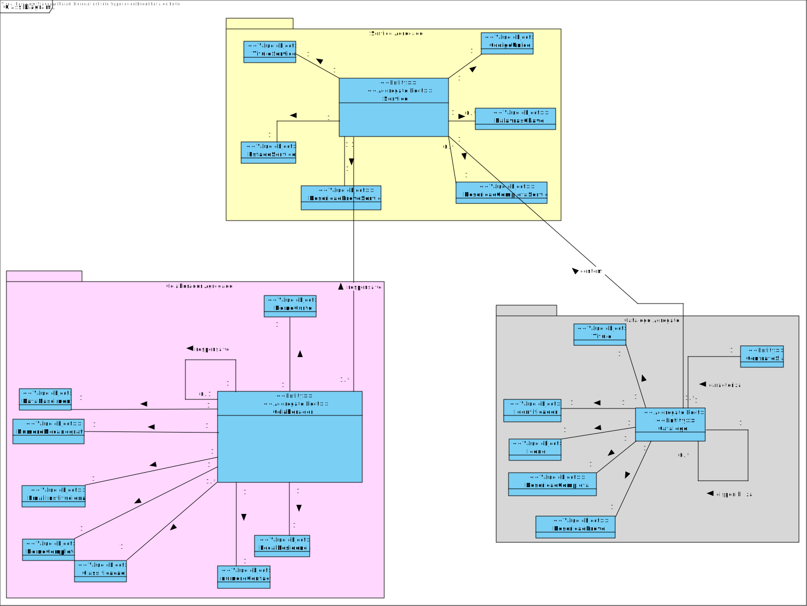
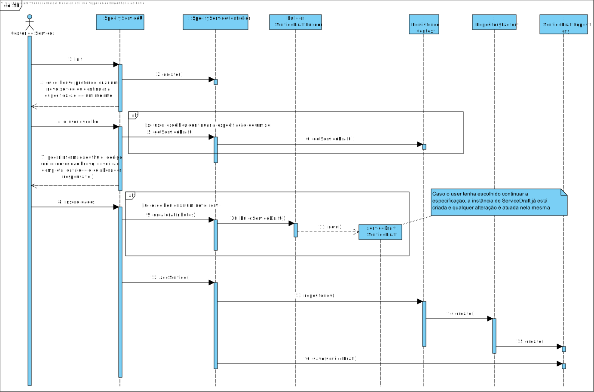

# US2002
=======================================


# 1. Requisitos

*Nesta secção a equipa deve indicar a funcionalidade desenvolvida bem como descrever a sua interpretação sobre a mesma e sua correlação e/ou dependência de/com outros requisitos.*


**US2002** Como Gestor de Serviços Help Desk (GSH), eu pretendo proceder à especificação de um novo serviço, devendo o sistema permitir que a mesma fique incompleta e seja, posteriomente, retomada.

- Como Gestor dos Serviços de Help Desk quando procedo à especificação de um novo serviço então pretendo que o mesmo só fique disponível para solicitação quando a sua especificação ficar completa e válida.

- Como Gestor dos Serviços de Help Desk quando procedo à especificação de um novo serviço então pretendo indicar apenas informação base do serviço (código, descrição, catálogo onde será disponibilizado, formulários, requer feedback). 

Para tal, este UC está dependente da criação de catálogos, para além de que é necessário permitir persistir versões incompletas de um serviço.

# 2. Análise

## SSD


## MD



# 3. Design

*Nesta secção a equipa deve descrever o design adotado para satisfazer a funcionalidade. Entre outros, a equipa deve apresentar diagrama(s) de realização da funcionalidade, diagrama(s) de classes, identificação de padrões aplicados e quais foram os principais testes especificados para validar a funcionalidade.*

*Para além das secções sugeridas, podem ser incluídas outras.*

## 3.1. Realização da Funcionalidade

## SD



## 3.2. Diagrama de Classes


## 3.3. Padrões Aplicados

Relativamente a padrões, foi aplicado o Builder para a especificação do serviço devido à sua complexidade de criação e posterior retoma de tal.
Para criação de entidades de persistência, foi aplicado o Abstract Factory juntamente com o Strategy, permitindo assim flexibilidade na escolha do método de persistência dos dados.

Em termos de melhores práticas, o caso de uso foi dividido nos packages de presentation, application, domain e repository. 

Foi aplicado também um dto aquando da apresentação dos dados de um serviço carregado pelo utilizador, de forma a diminuir o acoplamento e permitir uma maior facilidade na eventual alteração dos dados da respetiva entidade.

## 3.4. Testes 
**Teste 1:** Verificar que não é possível criar uma instância da classe ServiceDraft com valores do titulo e serviceCode a nulo.

```java
@Test(expected = IllegalArgumentException.class)
    public void failToCreateServiceWithoutID(){
        ServiceDraft b=new ServiceDraft ();
        String title="title";
        b.withTitle ( title ).build ();
    }

    @Test(expected = IllegalArgumentException.class)
    public void failToCreateServiceWithoutTitle(){
        ServiceDraft b=new ServiceDraft ();
        String id="id1";
        b.withServiceId ( id ).build ();
    }
```

**Teste 2: ** Verificar que não é possível criar uma instância da classe BriefDescription, CompleteDescription e ou Title se a descrição for nula, vazia ou se exceder o limite máximo de carateres

```java
@Test
public void createValidDescription(){
    String description="description1";
    BriefDescription d=new BriefDescription (description);
    assertEquals ( d.toString (),description );
}
@Test(expected = IllegalArgumentException.class)
public void failToCreateDescriptionWithNullString(){
    String description=null;
    new BriefDescription (description);
}
@Test(expected = IllegalArgumentException.class)
public void failToCreateDescriptionWithEmptyString1(){
    String description="";
    new BriefDescription (description);
}
@Test(expected = IllegalArgumentException.class)
public void failToCreateDescriptionWithEmptyString2(){
    String description="  ";
    new BriefDescription (description);
}
@Test(expected = IllegalArgumentException.class)
public void failToCreateDescriptionWithLongerTextThanAccepted(){
    new BriefDescription ( "a".repeat ( BriefDescription.BRIEF_DESCRIPTION_LENGTH + 1 ) );
}
```

Um caso de testes similar se aplica a CompleteDescription e Title.

**Teste 3: ** Verificar que não é possível criar uma instância da classe Keyword se a informação textual for nula ou vazia.

```java
@Test
public void successfullyCreateKeyword(){
    String keyword="keyword1";
    Keyword k=new Keyword (keyword);
    assertEquals ( k.toString (),keyword );
}
@Test(expected = IllegalArgumentException.class)
public void failToCreateKeywordWithNullString(){
    String keyword=null;
    new Keyword (keyword);
}
@Test(expected = IllegalArgumentException.class)
public void failToCreateKeywordWithEmptyString1(){
    String keyword="";
    new Keyword (keyword);
}
@Test(expected = IllegalArgumentException.class)
public void failToCreateKeywordWithEmptyString2(){
    String keyword="  ";
    new Keyword (keyword);
}
```

# 4. Implementação

## Commits

* Aplicação final da UI: https://bitbucket.org/Eduardooolol/lei20_21_s4_2di_02/commits/361f5a9fd13446231a796541e9814a49085297f1
* Aplicação inicial do ServiceBuilder: https://bitbucket.org/Eduardooolol/lei20_21_s4_2di_02/commits/ed5b0f69434cff3fcaa373ae076824462c24cd33

# 5. Integração/Demonstração

Para esta US, foi necessário integrar as classes relativas a serviço com as classes de colaborador e catálogo. Desta forma, foi necessária coordenação com os vários membros para garantir um bom fluxo de trabalho.

# 6. Observações

Uma possível melhoria seria utilizar um dto próprio para representar o colaborador e um outro dto para representar o catálogo aquando da especificação destes na ui, eliminando o acoplamento entre a camada de apresentação e de domínio.


