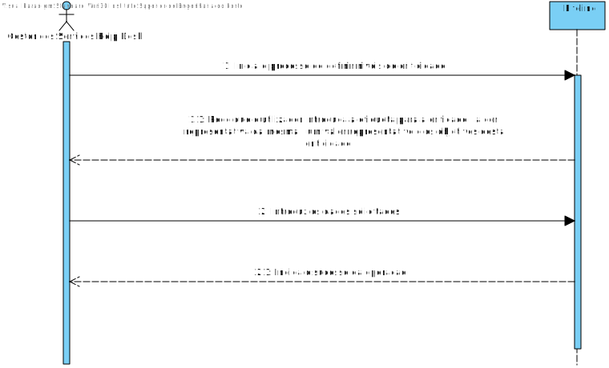
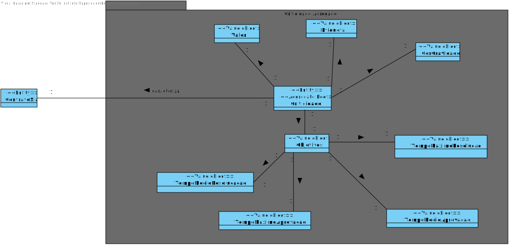
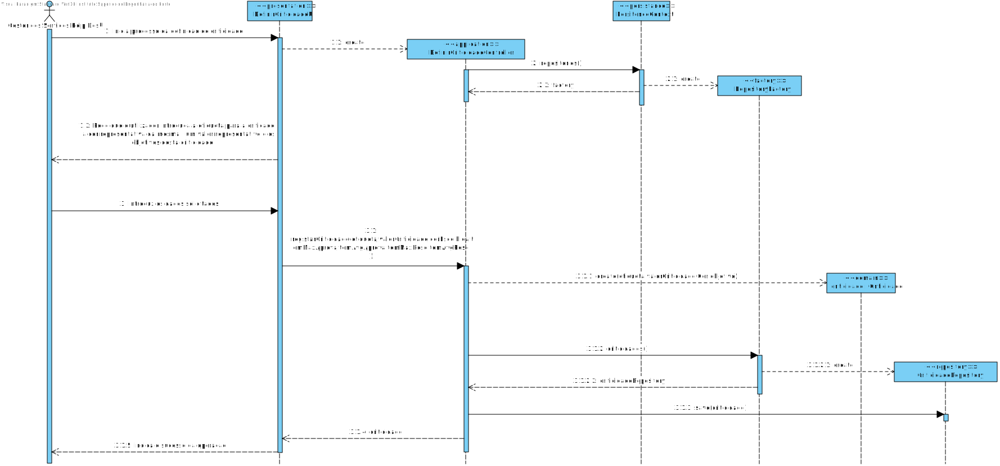
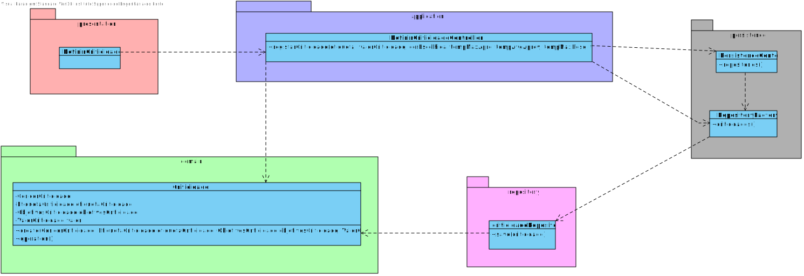

# US 2010 - Especificar um novo nivel de criticidade
=======================================

# 1. Requisitos

**US2010** Como Gestor de recursos humanos, eu pretendo definir os niveis de criticidade e respetivos objetivos aplicados na organização para definição de SLAs.

A interpretação feita deste requisito foi no sentido de especificar no sistema a existência de um novo nivel de criticidade.

# 2. Análise

O gestor de serviços help desk usa o seu menu para especificar um novo nivel de criticidade.

## 2.1 SSD 

## 2.2. Excerto do modelo de domínio

# 3. Design

Para dar resposta a este caso de uso, foi usado o padrão Controller, visto na classe controladora DefinirCriticidadeController. Este, é responsável pela organização e processo de criação de um criticidade no sistema, e subsequentemente, na base de dados. O controller usa classe de domain Criticidade para criar a instância da mesma. E para a sua persistência na base de dados, conforme referido, é usado a CriticidadeRepository.

## 3.1. Realização da Funcionalidade

## 3.2. Diagrama de Classes

## 3.3. Padrões Aplicados
*Nesta secção deve apresentar e explicar quais e como foram os padrões de design aplicados e as melhores práticas.*

Questão: Que Classe...|Resposta|Justificação (Padrão)|
|:----:|:---------------:|:-----:|
|é responsável por criar todos as classes Repository?|RepositoryFactory|Factory, quando uma entidade é demasiado complexa, as fábricas fornecem encapsulamento.|
|permite persistir a criticidade criadas? |CatalogoRepository|Repository, quando se pretende ocultar os detalhes de persistência/reconstrução de objetos cria-se uma classe Repository responsável por essas tarefas.|

## 3.4. Testes 
*Nesta secção deve sistematizar como os testes foram concebidos para permitir uma correta aferição da satisfação dos requisitos.*

**Teste 1:** Verificar que não é possível criar uma instância dos values objects com valores nulos.

	  @Test(expected = IllegalArgumentException.class)
    public void ensureNullIsNotAllowed() {
        EtiquetaCriticidade local = new EtiquetaCriticidade(null);
    }

**Teste 2:** Verificar que não é possível criar uma instância dos values objects com string vazias

	   @Test(expected = IllegalArgumentException.class)
    public void ensureEmptyIsNotAllowed() {
        EtiquetaCriticidade local = new EtiquetaCriticidade("    ");
    }

**Teste 3:** Verificar que não é possível criar uma instância dos values objects a ultrapassar o tamanho exigido

	@Test(expected = IllegalArgumentException.class)
    public void ensureSizeAllowed() {
        EtiquetaCriticidade local = new EtiquetaCriticidade(" aaaaaaaaaaaaaaaaaaaaaaaaaaaaaaaaaaaaaaaaaaaaaaaaaaaaaa   ");

**Teste 4:** Verificar que não é possível criar uma instância dos  objetivos a com minutos negativos
    
    @Test(expected = IllegalArgumentException.class)
    public void ensureCorrectValuesIsNotAllowed() {
        ObjetivosCriticidade ob = new ObjetivosCriticidade(-1,-1,-1,-1);
    }

**Teste 5:** Verificar que não é possível criar uma instância do valor da criticidade com valor negativo.

      @Test(expected = IllegalArgumentException.class)
    public void ensureNegativeValueIsNotAllowed() {
        ValorCriticidade ob = new ValorCriticidade(-1);
    }

**Teste 6:** Verificar que não é possível criar uma instância do valor da criticidade com valor acima de permitido.

    @Test(expected = IllegalArgumentException.class)
    public void ensureHighValuesIsNotAllowed() {
        ValorCriticidade ob = new ValorCriticidade(102);
    }

# 4. Implementação

Foram criadas na camada de domínio a entidade Criticidade e os respetivos Value Objects.

## Application

Nesta camada foi desenvolvido o Controller de registo de criticidade e um serviço que permite listar criticidades.

## Repository

Na camada de repository foi implementada a interface CriticidadeRepository, que é depois implementada em JPA e InMemory no módulo de impl.

## Presentation

Nesta camada foi desenvolvida a UI (consola) que faz a interação com o utilizador do sistema para registar a criticidade.

# 5. Integração/Demonstração

O colaborador a utilizar a aplicacao seja o Gestor de servicos help desk , e que introduza informucao que já nao exista.

# 6. Observações

No futuro talvez seja necessario integrar o contrato sla com a funcionalidade.

