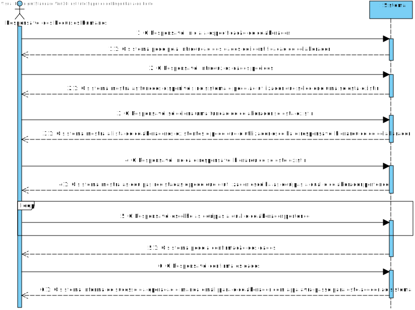
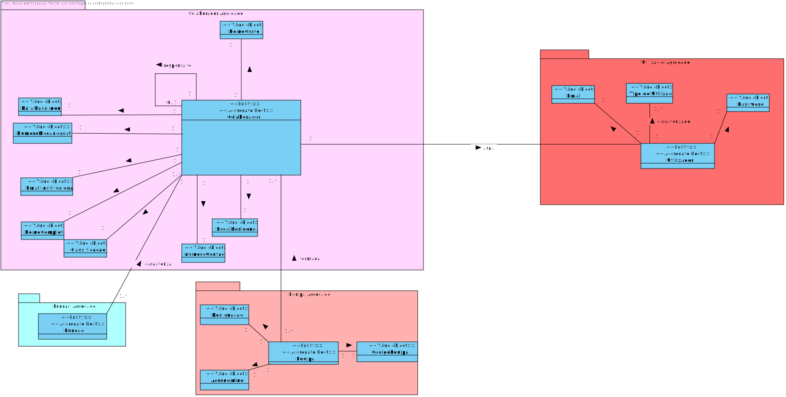
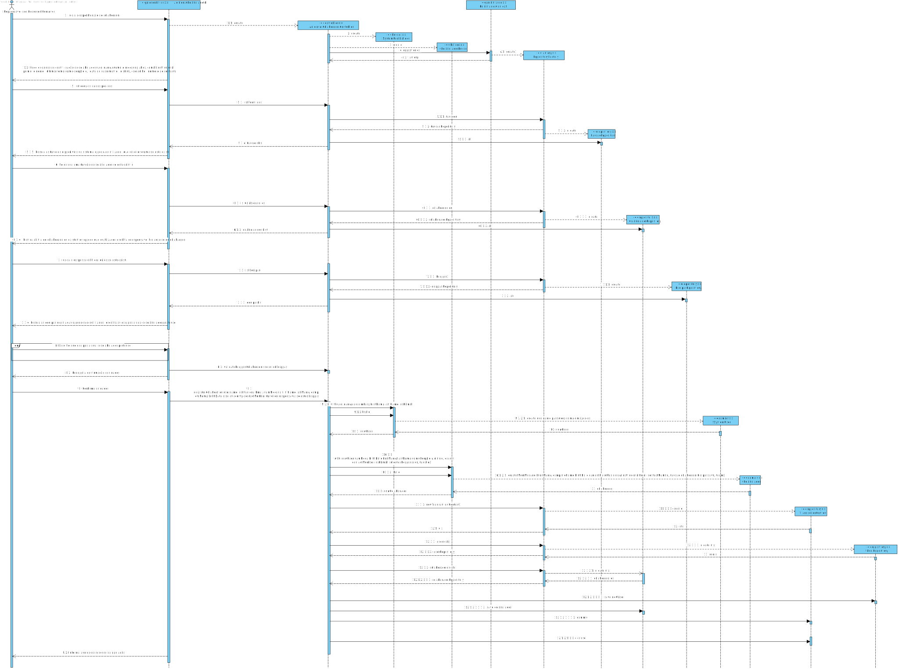
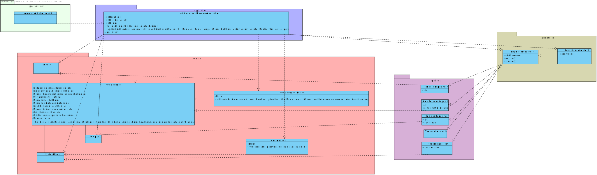

# UC 2051 - Especificar um novo colaborador no sistema.
=======================================

# 1. Requisitos

**UC2051** Como Gestor de recursos humanos, eu pretendo especificar um novo colaborador no sistema.

A interpretação feita deste requisito foi no sentido de especificar no sistema a existência de um novo colaborador.

# 2. Análise

O gestor de recursos humanos usa o seu menu para especificar um colaborador.

## 2.1 SSD 

## 2.2. Excerto do modelo de domínio

# 3. Design

Para dar resposta a este caso de uso, foi usado o padrão Controller, visto na classe controladora AdicionarColaboradorController. Este, é responsável pela organização e invoca o serviço, sendo este também um padrão, 'RegisterCollaboratorService' responsável pelo processo de criação de uma colaborador no sistema, e subsequentemente, na base de dados. O serviço usa classe de domain Colaborador para criar a instância da mesma. E para a sua persistência na base de dados, conforme referido, é usado o ColaboradorRepository.É também importante mencionar o facto de ser usado o padrão DTO
 para a escolha do responsável hierárquico do colaborador. Sendo que este responsável também é um colaborador, e na UI é utilizado o DTO de Colaborador de forma a esconder detalhes da implementação da classe de domínio.
## 3.1. Realização da Funcionalidade

## 3.2. Diagrama de Classes

## 3.3. Padrões Aplicados

*Nesta secção deve apresentar e explicar quais e como foram os padrões de design aplicados e as melhores práticas.*

Questão: Que Classe...|Resposta|Justificação (Padrão)|
|:----:|:---------------:|:-----:|
|é responsável por criar todos as classes Repository?|RepositoryFactory|Factory, quando uma entidade é demasiado complexa, as fábricas fornecem encapsulamento.|
|permite persistir os colaboradores criados? |ColaboradorRepository|Repository, quando se pretende ocultar os detalhes de persistência/reconstrução de objetos cria-se uma classe Repository responsável por essas tarefas.|
|conhece todas as equipas?|EquipaRepository|Information Expert, dado que é responsável pela persistência/reconstrução do Equipa, conhece todos os seus detalhes.|
|conhece todas as funcoes?|FuncoesRepository|Information Expert, dado que é responsável pela persistência/reconstrução da funcao, conhece todos os seus detalhes.|
|conhece todos os colaboradores do sistema?|ColaboradorRepository|Information Expert, dado que é responsável pela persistência/reconstrução do Colaborador, conhece todos os seus detalhes.|
|regista o colaborador | RegisterCollaboratorService| Service que realiza a operacao e coordena os objetos de domínio necessários .|
|apresenta a informação dos colaboradores | ColaboradorDTO | Dto que impede que a UI tenha acesso a todos os detalhes do objeto de dominio.|
## 3.4. Testes 
*De forma a verificar que os values objects seguem as regras de négocio realizou-se os seguintes testes.*

**Teste 1:** Verificar que não é possível criar uma instância dos values objectos com valor nulo.

	 @Test(expected = IllegalArgumentException.class)
    public void ensureNullIsNotAllowed() {
        DataNascimento data = new DataNascimento(null);
    }
**Teste 2:** Verificar que não é possível criar uma instância da classe DataNascimento no futuro.

    @Test(expected = IllegalArgumentException.class)
    public void ensureCorrectDateIsNotAllowed() {
        DATA_INVALIDA.set(2040,11,20);
        DataNascimento data = new DataNascimento(DATA_INVALIDA);
    }

**Teste 3:** Verificar que não é possível criar uma instância da classe DataNascimento de um colaborador com menos de 18 anos

    @Test(expected = IllegalArgumentException.class)
    public void ensureNotTooYoungToWork() {
    Calendar data = new GregorianCalendar();
    data.set(2015,11,20);
    DataNascimento data2 = new DataNascimento(data);
    }

**Teste 4:** Verificar que não é possível criar uma instância da classe DataNascimento de um colaborador com mais de 90 anos

    @Test(expected = IllegalArgumentException.class)
    public void ensureNotTooOldToWork() {
        Calendar data = new GregorianCalendar();
        data.set(1910,11,20);
        DataNascimento data2 = new DataNascimento(data);
    }

**Teste 5:** Verificar que uma instância dos values objects é igual a outra 
    
      @Test
    public void ensureTwoDatesAreEqual() {

        Calendar data = new GregorianCalendar();
        data.set(2015,11,20);

        DataNascimento data1 = new DataNascimento(data);
        DataNascimento data2 = new DataNascimento(data);
        assertEquals(data1, data2);
    }

**Teste 6:** Verificar que uma instância dos values objects nao sao iguais a outras.

    @Test
    public void ensureTwoDatesAreDifferent() {
        Calendar data = new GregorianCalendar();
        data.set(2015,11,20);
        Calendar data2 = new GregorianCalendar();
        data.set(2018,11,20);
        assertNotEquals(data,data2);
    }

**Teste 7:** Verificar que não é possível criar uma instância da classe EmailInstitucional  com valor nulo.

    @Test(expected = IllegalArgumentException.class)
    public void ensureNullIsNotAllowed() {
        EmailInstitucional emailInstitucional = new EmailInstitucional(null);
    }

**Teste 8:** Verificar que não é possível criar uma instância da classe EmailInstitucional  que nao siga um formato correto.
    
    private static final String INVALID_EMAIL = "CANDIDO11231.COM";
    @Test(expected = IllegalArgumentException.class)
    public void ensureIncorrectNotAllowed() {
        EmailInstitucional emailInstitucional = new EmailInstitucional(INVALID_EMAIL);
    }

**Teste 9:** Verificar que não é possível criar uma instância do Nome que ultrapasse um certo tamanho.

    @Test(expected = IllegalArgumentException.class)
    public void ensureCorrectLengthAllowed() {
        NomeCompleto local = new NomeCompleto("adssssssssssssssssssssssssssssssssssssssssssssssssssssssssssssssssssssssssssssssssssssssssssssssssssssssssssssssssssssssssssssssssssssssssssssssssssssssssss");
    }

# 4. Implementação

## Domain

Foram criadas na camada de domínio a entidade Colaborador e os respetivos Value Objects.

## Application

Nesta camada foi desenvolvido o Controller de registo de colaborador e o serviço de registo de colaborador.

## Repository

Na camada de repository foi implementada a interface ColaboradorRepository, que é depois implementada em JPA e InMemory no módulo de impl.

## Presentation

Nesta camada foi desenvolvida a UI (consola) que faz a interação com o utilizador do sistema para registar o colaborador.

# 5. Integração/Demonstração

O colaborador atual ser o gestor de recursos de humanos. Nesta fase utilizou-se DTO de colaborador de forma que a UI nao tenha acesso ao objeto de domínio de colaborador.
Para além disso também se usa serviço de registo de colaborador.

# 6. Observações

~~No futuro poderá ser  melhorado a maneira como se realiza a User story e é possivel integrar mais formas de como o colaborador registado recebe a password (Talvez implementar para que este receba um email com a password e as informacoes registadas no sistema).~~
(Melhoria realizada no sprint C)

