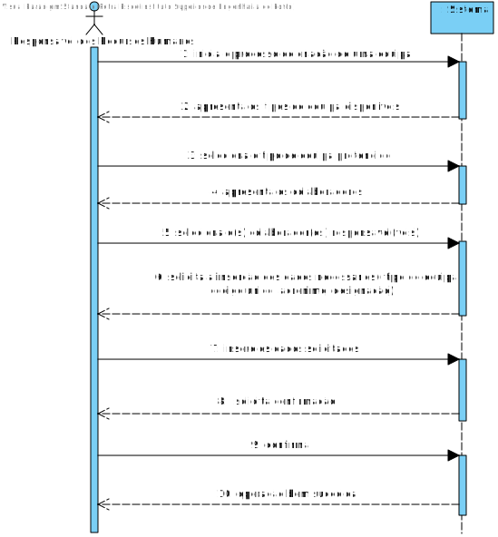
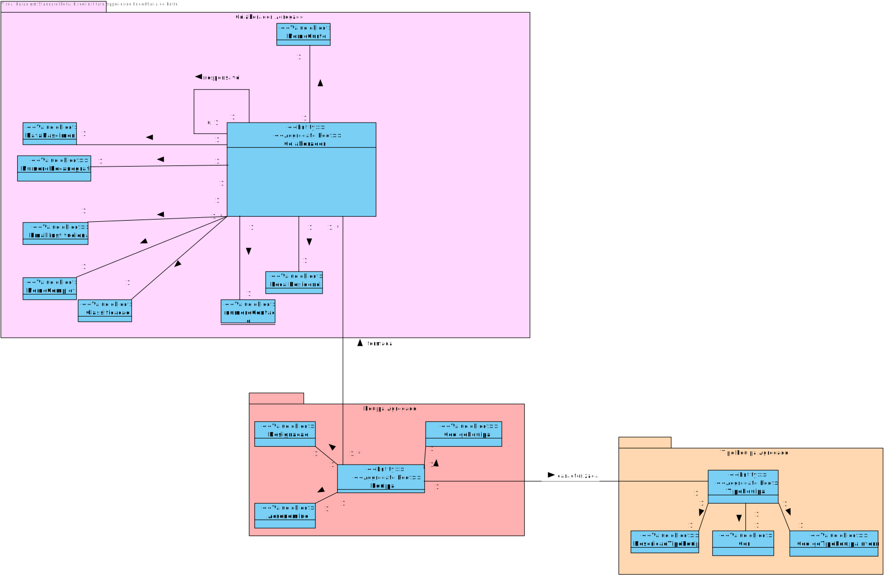
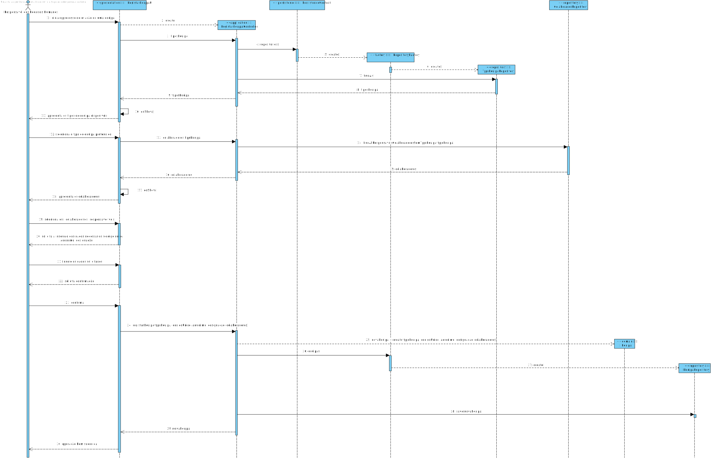
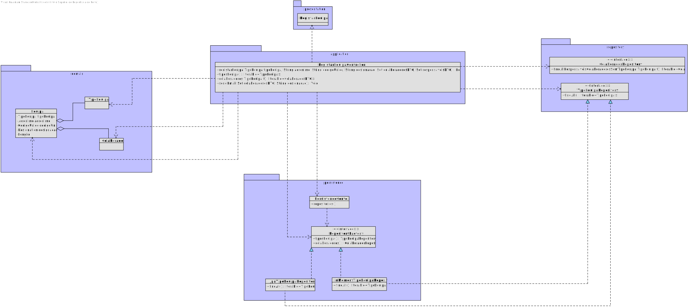

US 2052
===========================================

# 1. Requisitos

**US2052:** Como Responsável dos Recursos Humanos (RRH), eu pretendo criar uma nova equipa.

- Como Responsável dos Recursos Humanos (RRH), quando crio uma nova equipa então pretendo que esta fique disponível no sistema.

Para tal, pretendo conhecer os Tipos de Equipa disponíveis no Sistema para poder adequadamente identificar em qual se enquadra a equipa a criar.

# 2. Análise

## 2.1 SSD

## 2.2 Excerto do MD

# 3. Design

## 3.1. Realização da Funcionalidade

*Nesta secção deve apresentar e descrever o fluxo/sequência que permite realizar a funcionalidade.*

## 3.2. Diagrama de Classes

*Nesta secção deve apresentar e descrever as principais classes envolvidas na realização da funcionalidade.*

## 3.3. Padrões Aplicados

Questão: Que Classe...|Resposta|Justificação (Padrão)|
|:----:|:---------------:|:-----:|
|é responsável por criar todos as classes Repository?|RepositoryFactory|Factory, quando uma entidade é demasiado complexa, as fábricas fornecem encapsulamento.|
|permite persistir as equipas criadas? |EquipaRepository|Repository, quando se pretende ocultar os detalhes de persistência/reconstrução de objetos cria-se uma classe Repository responsável por essas tarefas.|
|conhece todos os tipos de equipa?|TipoEquipaRepository|Information Expert, dado que é responsável pela persistência/reconstrução do TipoEquipa, conhece todos os seus detalhes.|
|conhece todos os colaboradores do sistema?|ColaboradorRepository|Information Expert, dado que é responsável pela persistência/reconstrução do TipoEquipa, conhece todos os seus detalhes.|
|é responsável por isolar o Domínio da Apresentação?|ColaboradorDTO|DTO, por forma a diminuir o número de invocações de métodos e esconder detalhes da camada de Domínio, recorre-se a um objeto que contém toda a informação necessária a apresentar.|

## 3.4. Testes

**Teste 1:** Verificar que não é possível criar uma instância da classe CodigoUnico com tamanho superior a 15

   @Test(expected=IllegalArgumentException.class)
   public void ensureAboveMaxLengthParameterIsNotAllowed(){
       System.out.println("-----Test 4 (length > 15)-----\n");
       CodigoUnico acronimo = new CodigoUnico("Ab111CdEfG1HIJ12345KLMnS");
   }

**Teste 2:** Verificar que não é possível criar uma instância da classe CodigoUnico com valores unicamente numéricos, dado que o Código Único
 deve ser alfanumérico.

    @Test(expected=IllegalArgumentException.class)
    public void testInvalidCodigo05(){
        System.out.println("-----Test 5 (only numeric)-----\n");
        CodigoUnico acronimo = new CodigoUnico("123456789123456");
    }
**Teste 3:** Verificar que não é possível criar uma instância da Classe Acronimo com valores null

     @Test(expected=IllegalArgumentException.class)
     public void testInvalidAcronimo03(){
     System.out.println("-----Test 3 (null)-----\n");
     Acronimo acronimo = new Acronimo(null);
     }

**Teste 4:** Verificar que não é possível criar uma instância da Classe Equipa com valores vazios

    @Test(expected = IllegalArgumentException.class)
    public void ensureEmptyParameterIsNotAllowed(){
        Equipa e = new Equipa(Acronimo.valueOf(""), CodigoUnico.valueOf(""), Designation.valueOf(""), new TipoEquipa(null,
                new CodigoUnico(""), Description.valueOf("")),new HashSet<>(), new HashSet<>());
    }

# 4. Implementação

## 4.1. Arquitetura em Camadas
### Domain
Foram criadas na camada de domínio a entidade Equipa e os respetivos Value Objects.
### Application
Nesta camada foi desenvolvido o Controller de registo da Equipa
### Repository
Na camada de repository foi implementada a interface EquipaRepository, que é depois implementada em JPA e InMemory no módulo de impl.
### Presentation
Nesta camada foi desenvolvida a UI (consola) que faz a interação entre o Responsável dos Recursos Humanos e o sistema, permitindo o 
registo de uma Equipa.

## 4.2. Commits Relevantes
* Aplicação da UI: https://bitbucket.org/Eduardooolol/lei20_21_s4_2di_02/commits/5f5e5329418a05b30bded3ac547199655a507052
* Integração do ColaboradorDTO: https://bitbucket.org/Eduardooolol/lei20_21_s4_2di_02/commits/8cd9342d333025767fa224f8ec4269e2a45a3184

## 4.3. Estruturação da Classe Equipa
Apesar do atributo codigoUnico na classe identificar univocamente a Equipa, optou-se por criar um atributo artificial id do tipo Long que garante uma maior eficiência quando comparado com um identificador do tipo String.

*Recomenda-se que organize este conteúdo por subsecções.*

# 5. Integração/Demonstração

Dado que a User Story de Registo da Equipa está intrinsecamente conectada com a classe de Colaborador foi necessária a coordenação com o elemento do grupo responsável pelo caso de uso que visa a criação de Colaboradores,
bem como, com os restantes colegas (nomeadamente o colega responsável pela Criação de Catálogos) por forma a garantir um melhor fluxo de trabalho e uma maior coerência nas decisões tomadas.

# 6. Observações

~~Uma possível melhoria seria utilizar um DTO para o Colaborador, eliminando o acoplamento entre a camada de apresentação e de domínio.~~
