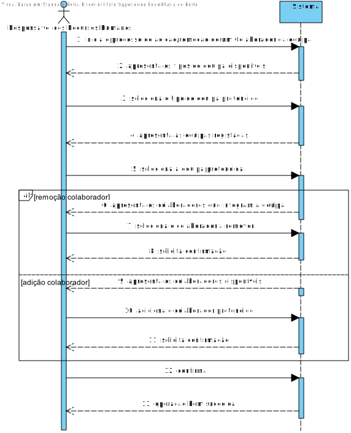
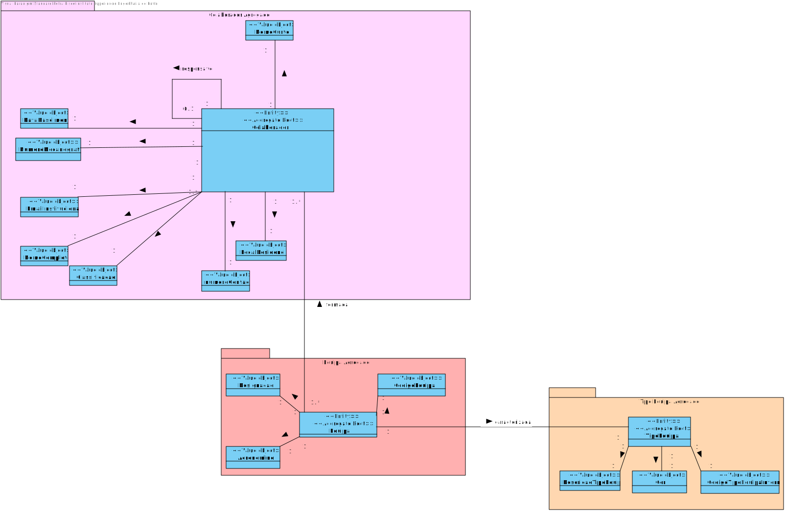
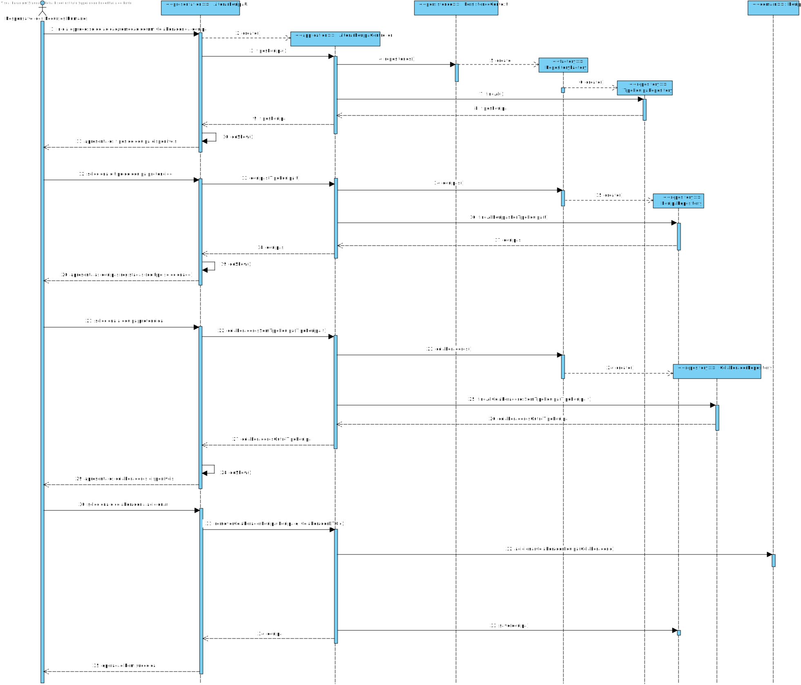
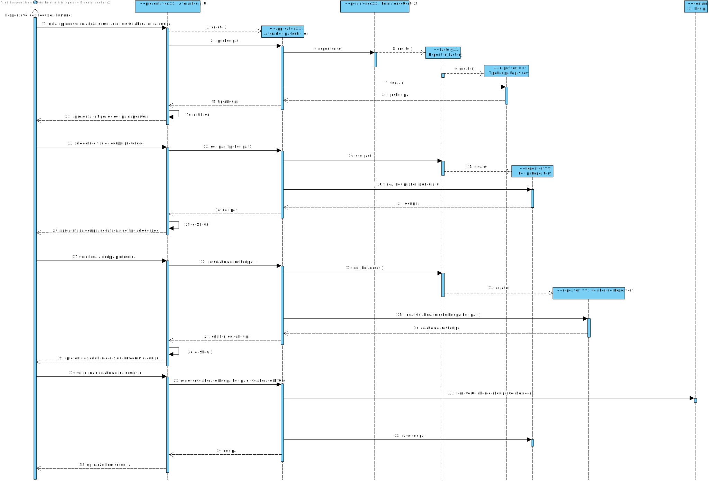
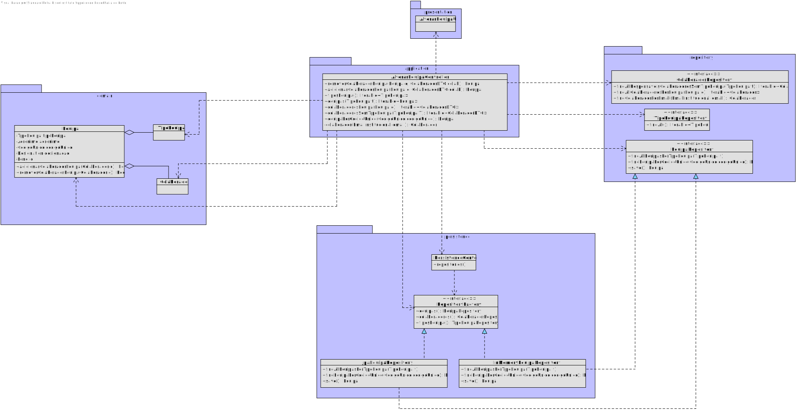

US2053
=======================================

# 1. Requisitos

*Nesta secção a equipa deve indicar a funcionalidade desenvolvida bem como descrever a sua interpretação sobre a mesma e sua correlação e/ou dependência de/com outros requisitos.*

**US2053** Como Responsável dos Recursos Humanos (RRH), eu pretendo associar/remover um colaborador a uma equipa.

- Como Responsável dos Recursos Humanos (RRH), quando associo/removo um colaborador a uma equipa então pretendo que as modificações se reflitam no sistema.

Para tal, pretendo conhecer os Colaboradores que integram a equipa (excluindo o(s) Responsável(eis)) ou os Colaboradores aptos para integrar (Colaboradores não incluídos noutra equipa 
do mesmo tipo).

# 2. Análise

## 2.1 SSD

## 2.2 Excerto do MD

# 3. Design

## 3.1. Realização da Funcionalidade
Para maior simplificação optou-se por distinguir as funcionalidades de Adicionar e Remover Colaboradores de uma Equipa, pelo que se procedeu ao desenvolvimento de dois 
diagramas de sequência.

## 3.2. Diagrama de Classes

## 3.3. Padrões Aplicados

Questão: Que Classe...|Resposta|Justificação (Padrão)|
|:----:|:---------------:|:-----:|
|é responsável por criar todos as classes Repository?|RepositoryFactory|Factory, quando uma entidade é demasiado complexa, as fábricas fornecem encapsulamento.|
|permite persistir as equipas alteradas? |EquipaRepository|Repository, quando se pretende ocultar os detalhes de persistência/reconstrução de objetos cria-se uma classe Repository responsável por essas tarefas.|
|conhece todos os tipos de equipa?|TipoEquipaRepository|Information Expert, dado que é responsável pela persistência/reconstrução do TipoEquipa, conhece todos os seus detalhes.|
|conhece todos os colaboradores do sistema?|ColaboradorRepository|Information Expert, dado que é responsável pela persistência/reconstrução do TipoEquipa, conhece todos os seus detalhes.|
|é responsável por isolar o Domínio da Apresentação?|ColaboradorDTO|DTO, por forma a diminuir o número de invocações de métodos e esconder detalhes da camada de Domínio, recorre-se a um objeto que contém toda a informação necessária a apresentar.|

## 3.4. Testes 

Dada a simplicidade da User Story não se efetuaram quaisquer testes.

# 4. Implementação

## 4.1. Arquitetura em Camadas
### Domain
Não foi necessária a criação de classes de domínio, utilizaram-se as anteriormente criadas para o US2052 - entidade Equipa e os respetivos Value Objects.
### Application
Nesta camada foi desenvolvido o Controller de alteração da constituição da Equipa
### Repository
Na camada de repository foi utilizada a previamente implementada interface EquipaRepository, que é depois implementada em JPA e InMemory no módulo de impl.
### Presentation
Nesta camada foi desenvolvida a UI (consola) que faz a interação entre o Responsável dos Recursos Humanos e o sistema, permitindo a
alteração de uma Equipa.

## 4.2. Commits Relevantes
* Integração do ColaboradorDTO:

# 5. Integração/Demonstração

Dado que a User Story de Alteração da Equipa está intrinsecamente conectada com a classe de Colaborador foi necessária a coordenação com o elemento do grupo responsável pelo caso de uso que visa a criação de Colaboradores,
bem como, com os restantes colegas (nomeadamente o colega responsável pela Criação de Catálogos) por forma a garantir um melhor fluxo de trabalho e uma maior coerência nas decisões tomadas.

# 6. Observações

~~Uma possível melhoria seria utilizar um DTO para o Colaborador, eliminando o acoplamento entre a camada de apresentação e de domínio.~~

