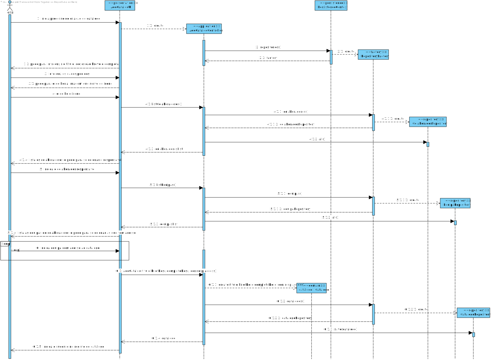

# US2001
=======================================

# 1. Requisitos

**UC2001** Como Gestor de Serviços de Help desk (GSH), eu pretendo criar um novo catálogo de serviços.

# 2. Análise

## 2.1. SSD

## 2.2. Excerto do modelo de domínio

# 3. Design

*Nesta secção a equipa deve descrever o design adotado para satisfazer a funcionalidade. Entre outros, a equipa deve apresentar diagrama(s) de realização da funcionalidade, diagrama(s) de classes, identificação de padrões aplicados e quais foram os principais testes especificados para validar a funcionalidade.*

*Para além das secções sugeridas, podem ser incluídas outras.*

## 3.1. Realização da Funcionalidade

## 3.2. Diagrama de Classes

## 3.3. Padrões Aplicados

*Nesta secção deve apresentar e explicar quais e como foram os padrões de design aplicados e as melhores práticas.*

Questão: Que Classe...|Resposta|Justificação (Padrão)|
|:----:|:---------------:|:-----:|
|é responsável por criar todos as classes Repository?|RepositoryFactory|Factory, quando uma entidade é demasiado complexa, as fábricas fornecem encapsulamento.|
|permite persistir os catalogos criados? |CatalogoRepository|Repository, quando se pretende ocultar os detalhes de persistência/reconstrução de objetos cria-se uma classe Repository responsável por essas tarefas.|
|conhece todas as equipas?|EquipaRepository|Information Expert, dado que é responsável pela persistência/reconstrução do Equipa, conhece todos os seus detalhes.|
|conhece todos os colaboradores do sistema?|ColaboradorRepository|Information Expert, dado que é responsável pela persistência/reconstrução do Colaborador, conhece todos os seus detalhes.|

## 3.4. Testes 
*Nesta secção deve sistematizar como os testes foram concebidos para permitir uma correta aferição da satisfação dos requisitos.*

Para os ValueObjects (Title, BriefDescription e CompleteDescription) foram desenvolvidos testes de forma a validar se não são null, vazios e se é cumprido o tamanho máximo estipulado, como é possível ver nos seguintes exemplos:

**Teste 1:** Verificar que não é possível criar uma instância da classe Title com valor nulo.

	@Test(expected = IllegalArgumentException.class)
    public void ensureNullIsNotAllowed() {
        Title title = new Title(null);
    }

**Teste 2:** Verificar que não é possível criar uma instância da classe BriefDescription com String vazia.

	@Test(expected = IllegalArgumentException.class)
    public void ensureEmptyIsNotAllowed() {
        BriefDescription briefDesc = new BriefDescription("");
    }

**Teste 3:** Verificar que não é possível criar uma instância da classe CompleteDescription com tamanho maior que 100.

	@Test(expected = IllegalArgumentException.class)
    public void ensureLengthIsLess100() {
        StringBuilder builder = new StringBuilder();
        for (int i = 0; i < 105; i++) builder.append("a");
        CompleteDescription desc = new CompleteDescription(builder.toString());
    }

Para além destes, foram desenvolvidos testes para verificar igualdade de ValueObjects (também no Icon):

**Teste 4:** Verificar que duas instâncias de Icon são iguais.

	@Test
    public void ensureTwoTitlesAreEqual() {
        Icon icon1 = new Icon(new byte[] {1,2,3});
        Icon icon2 = new Icon(new byte[] {1,2,3});
        assertEquals(icon1, icon2);
    }

**Teste 5:** Verificar que duas instâncias de Icon são diferentes.

	@Test
    public void ensureTwoTitlesAreDifferent() {
        Icon icon1 = new Icon(new byte[] {1,2,3});
        Icon icon2 = new Icon(new byte[] {1});
        assertNotEquals(icon1, icon2);
    }

Na entidade Catalog foram criados testes para validar os parâmetros.

**Teste 6:** Verificar que não pode ser criada uma instância de Catalog com parâmetros nulos.

	@Test(expected = IllegalArgumentException.class)
    public void ensureNullParameterIsNotAllowed() {
        Catalog catalog = new Catalog((Title) null, null, null, null, null, null);
    }

# 4. Implementação

## Domain

Foram criadas na camada de domínio a entidade Catalog e os respetivos Value Objects.

## Application

Nesta camada foi desenvolvido o Controller de registo de catálogo

## Repository

Na camada de repository foi implementada a interface CatalogRepository, que é depois implementada em JPA e InMemory no módulo de impl.

## Presentation

Nesta camada foi desenvolvida a UI (consola) que faz a interação com o utilizador do sistema para regista o Catalog.

# 5. Integração/Demonstração

Para desenvolver esta funcionalidade foi necessário integrar tendo em conta as funcionalidades de registar colaborador e registar equipa, já que estes são dados pedidos no registo do catálogo. Pelo menos o colaborador é necessário que exista antes de iniciar esta funcionalidade, já que o colaborador responsável é obrigatório.

# 6. Observações

No futuro poderá ser necessário alterar a forma como são escolhidos os critérios de acesso (já que de momento é pedido que apenas são escolhidas as equipas). E também poderá ser implementado no futo o suporte a catálogos dentro de catálogos.
