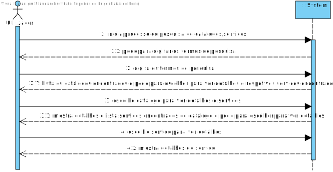
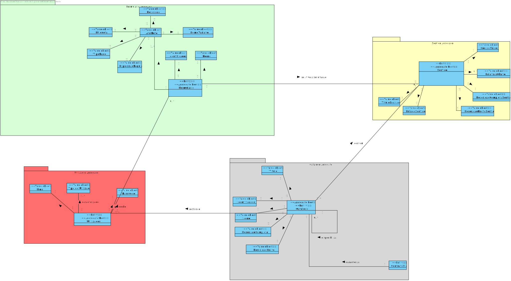
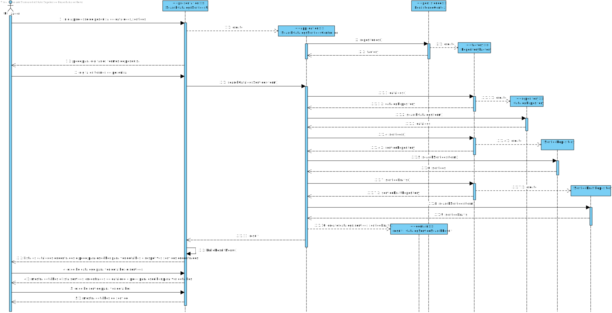
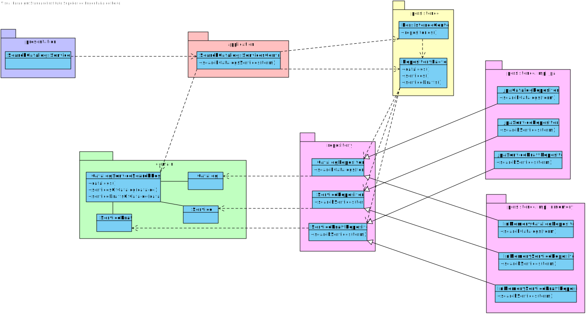

# US3001
=======================================

# 1. Requisitos

**US3001** Como utilizador, eu pretendo consultar/pesquisar os catálogos de serviços e respetivos serviços que me estão/são disponibilizados.

# 2. Análise

## 2.1. SSD

## 2.2. Excerto do modelo de domínio

# 3. Design

*Nesta secção a equipa deve descrever o design adotado para satisfazer a funcionalidade. Entre outros, a equipa deve apresentar diagrama(s) de realização da funcionalidade, diagrama(s) de classes, identificação de padrões aplicados e quais foram os principais testes especificados para validar a funcionalidade.*

*Para além das secções sugeridas, podem ser incluídas outras.*

## 3.1. Realização da Funcionalidade

## 3.2. Diagrama de Classes

## 3.3. Padrões Aplicados

*Nesta secção deve apresentar e explicar quais e como foram os padrões de design aplicados e as melhores práticas.*

Questão: Que Classe...|Resposta|Justificação (Padrão)|
|:----:|:---------------:|:-----:|
|é responsável por criar todos as classes Repository?|RepositoryFactory|Factory, quando uma entidade é demasiado complexa, as fábricas fornecem encapsulamento.|
|conhece todas os catalogos?|CatalogRepository|Information Expert, dado que é responsável pela persistência/reconstrução de Catalog, conhece todos os seus detalhes.|
|conhece todos os serviços?|ServiceRepository|Information Expert, dado que é responsável pela persistência/reconstrução de Service, conhece todos os seus detalhes.|
|conhece todos os service drafts?|ServiceDraftRepository|Information Expert, dado que é responsável pela persistência/reconstrução de ServiceDraft, conhece todos os seus detalhes.|

## 3.4. Testes 
*Nesta secção deve sistematizar como os testes foram concebidos para permitir uma correta aferição da satisfação dos requisitos.*

Foram desenvolvidos testes para validar que na classe de resultados de pesquisa não são recebidos parametros nulos.

**Teste 1:** Verificar que não é possível criar uma instância da classe CatalogServiceSearchResultTest com valor nulos.

	@Test(expected = IllegalArgumentException.class)
    public void ensureNoParameterIsNull1() {
        List<Service> services = new ArrayList<>();
        List<ServiceDraft> serviceDrafts = new ArrayList<>();
        CatalogServiceSearchResult result = new CatalogServiceSearchResult(null, services, serviceDrafts);
    }

**Teste 2:** Verificar que não é possível criar uma instância da classe CatalogServiceSearchResultTest com valor nulos.

	@Test(expected = IllegalArgumentException.class)
    public void ensureNoParameterIsNull2() {
        List<Catalog> catalogs = new ArrayList<>();
        List<ServiceDraft> serviceDrafts = new ArrayList<>();
        CatalogServiceSearchResult result = new CatalogServiceSearchResult(catalogs, null, serviceDrafts);
    }

**Teste 3:** Verificar que não é possível criar uma instância da classe CatalogServiceSearchResultTest com valor nulos.

	@Test(expected = IllegalArgumentException.class)
    public void ensureNoParameterIsNull3() {
        List<Catalog> catalogs = new ArrayList<>();
        List<Service> services = new ArrayList<>();
        CatalogServiceSearchResult result = new CatalogServiceSearchResult(catalogs, services, null);
    }

# 4. Implementação

## Domain

Foi criada uma classe CatalogServiceSearchResult para armazenar e tratar os resultados de pesquisa de Catalog, Service e ServiceDraft.

## Application

Nesta camada está presente o Controller responsável por fazer a pesquisa e armazenar na classe de resultado.

## Presentation

Nesta camada está a UI, responsável pela interação com o utilizador do sistema, que tem que digitar os termos de pesquisa para poder consultar os resultados.

# 5. Integração/Demonstração

Para desenvolver esta funcionalidade foi necessário integrar com as funcionalidades de catálogo e de especificação de serviço, já que depende diretamente destas classes e repositorios.

# 6. Observações

Uma possível futura melhoria, seria ter em conta o colaborador loggado, ao fazer a pesquisa.
