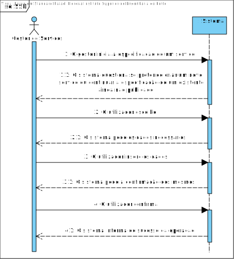
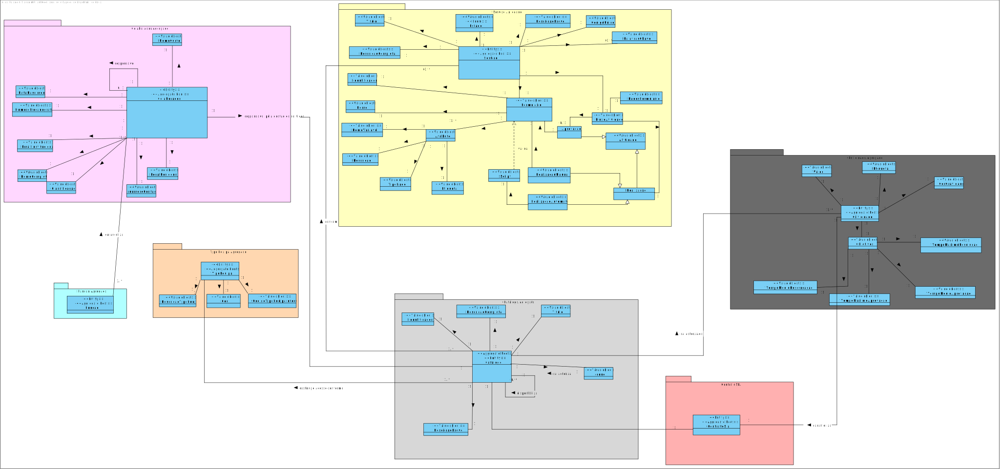
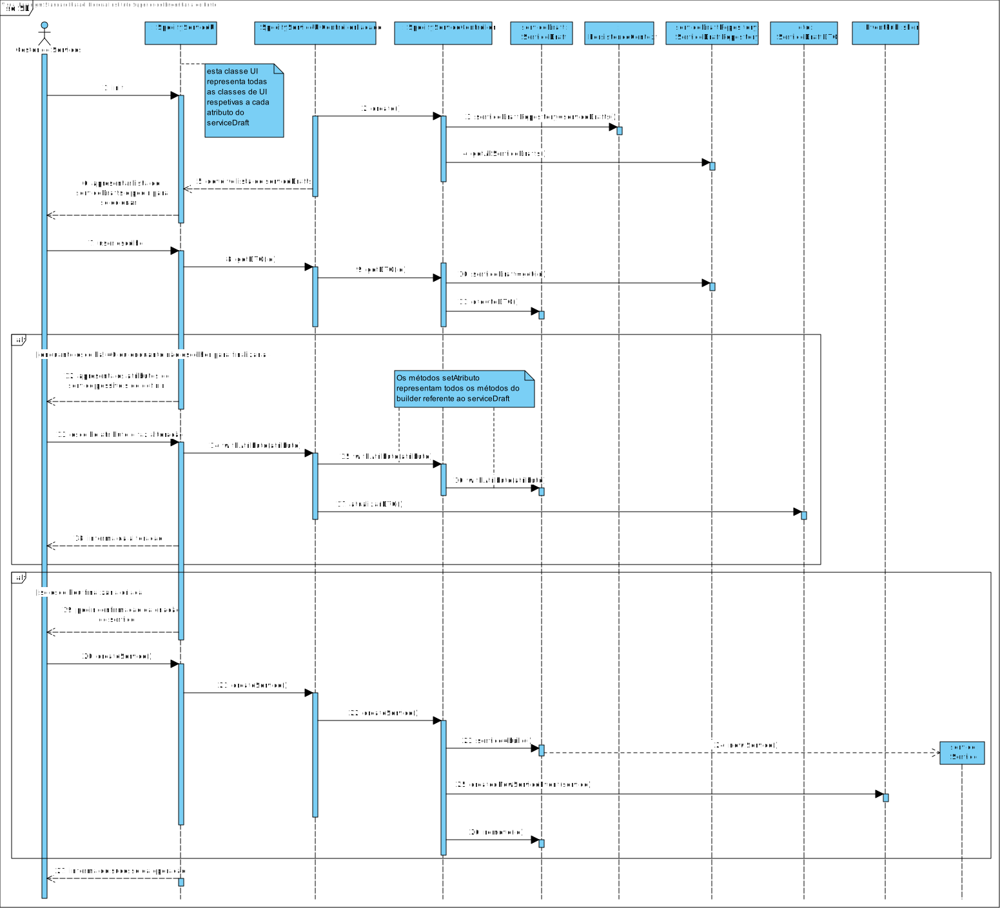
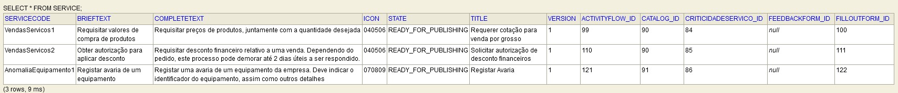

# US2003
=======================================


# 1. Requisitos

**US2003** Como Gestor de Serviços Help Desk (GSH), eu pretendo continuar a especificação de um serviço, podendo este ser finalizado.

# 2. Análise

## SSD



## MD



# 3. Design

## 3.1. Realização da Funcionalidade

## SD



## 3.2. Diagrama de Classes


## 3.3. Padrões Aplicados

Relativamente a padrões, foi aplicado o Builder para a especificação do serviço devido à sua complexidade de criação e posterior retoma de tal.
Para criação de entidades de persistência, foi aplicado o Abstract Factory juntamente com o Strategy, permitindo assim flexibilidade na escolha do método de persistência dos dados.

Em termos de melhores práticas, o caso de uso foi dividido nos packages de presentation, application, domain e repository. 

Foi aplicado também um dto aquando da apresentação dos dados de um serviço carregado pelo utilizador, de forma a diminuir o acoplamento e permitir uma maior facilidade na eventual alteração dos dados da respetiva entidade.

Devido ao elevado número elevado de classes de UI, foi usado padrão facade para diminuir o acoplamento do package de apresentação com o package de aplicação.

Para permitir o uso da mesma instância da facade para todas as UI, esta foi injetada como dependência para todas as classes UI.

Como ao criar o serviço em si já se estaria a alterar não só o repositório do ServiceDraft como também o do Service, foi usado um evento para publicar a criação da nova entidade Service, através do pubsub da framework, que utiliza o padrão Observer.

## 3.4. Testes 
**Teste 1:** Verificar que não é possível criar uma instância da classe ServiceDraft com valores do titulo e serviceCode a nulo.

```java
@Test(expected = IllegalArgumentException.class)
    public void failToCreateServiceWithoutID(){
        ServiceDraft b=new ServiceDraft ();
        String title="title";
        b.withTitle ( title ).build ();
    }

    @Test(expected = IllegalArgumentException.class)
    public void failToCreateServiceWithoutTitle(){
        ServiceDraft b=new ServiceDraft ();
        String id="id1";
        b.withServiceId ( id ).build ();
    }
```

**Teste 2: ** Verificar que não é possível criar uma instância da classe BriefDescription, CompleteDescription e ou Title se a descrição for nula, vazia ou se exceder o limite máximo de carateres

```java
@Test
public void createValidDescription(){
    String description="description1";
    BriefDescription d=new BriefDescription (description);
    assertEquals ( d.toString (),description );
}
@Test(expected = IllegalArgumentException.class)
public void failToCreateDescriptionWithNullString(){
    String description=null;
    new BriefDescription (description);
}
@Test(expected = IllegalArgumentException.class)
public void failToCreateDescriptionWithEmptyString1(){
    String description="";
    new BriefDescription (description);
}
@Test(expected = IllegalArgumentException.class)
public void failToCreateDescriptionWithEmptyString2(){
    String description="  ";
    new BriefDescription (description);
}
@Test(expected = IllegalArgumentException.class)
public void failToCreateDescriptionWithLongerTextThanAccepted(){
    new BriefDescription ( "a".repeat ( BriefDescription.BRIEF_DESCRIPTION_LENGTH + 1 ) );
}
```

Um caso de testes similar se aplica a CompleteDescription e Title.

**Teste 3: ** Verificar que não é possível criar uma instância da classe Keyword se a informação textual for nula ou vazia.

```java
@Test
public void successfullyCreateKeyword(){
    String keyword="keyword1";
    Keyword k=new Keyword (keyword);
    assertEquals ( k.toString (),keyword );
}
@Test(expected = IllegalArgumentException.class)
public void failToCreateKeywordWithNullString(){
    String keyword=null;
    new Keyword (keyword);
}
@Test(expected = IllegalArgumentException.class)
public void failToCreateKeywordWithEmptyString1(){
    String keyword="";
    new Keyword (keyword);
}
@Test(expected = IllegalArgumentException.class)
public void failToCreateKeywordWithEmptyString2(){
    String keyword="  ";
    new Keyword (keyword);
}
```

# 4. Implementação

## Commits

* Aplicação final da criação do serviço a partir do draft: https://bitbucket.org/Eduardooolol/lei20_21_s4_2di_02/commits/2bd2937a90bffa72ffdcd06139aceb2440fdbebe
* Alteração da criação dos serviços para eventos: https://bitbucket.org/Eduardooolol/lei20_21_s4_2di_02/commits/e3c7ffc9c869237c15a2e1e4bfa57dd6060b3564

# 5. Integração/Demonstração



Como se pode observar na figura acima, a base de dados possuí serviços completamente especificados prontos para serem publicados, como o cliente assim o pediu.

# 6. Observações

Existem algumas melhorias possíveis, nomeadamente a remoção da base de dados do rascunho de serviço quando este é convertido em serviço, assim como os rascunhos de formulários.


