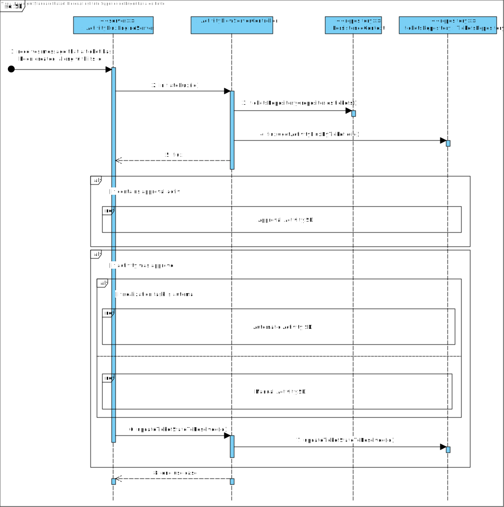
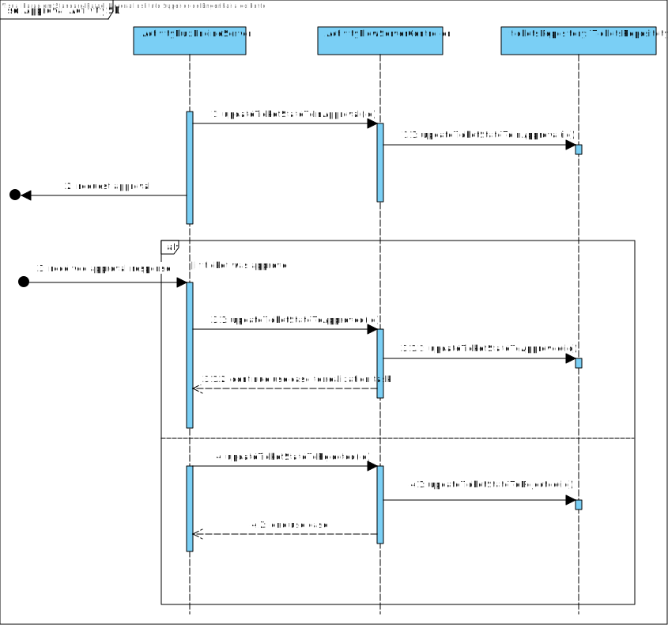
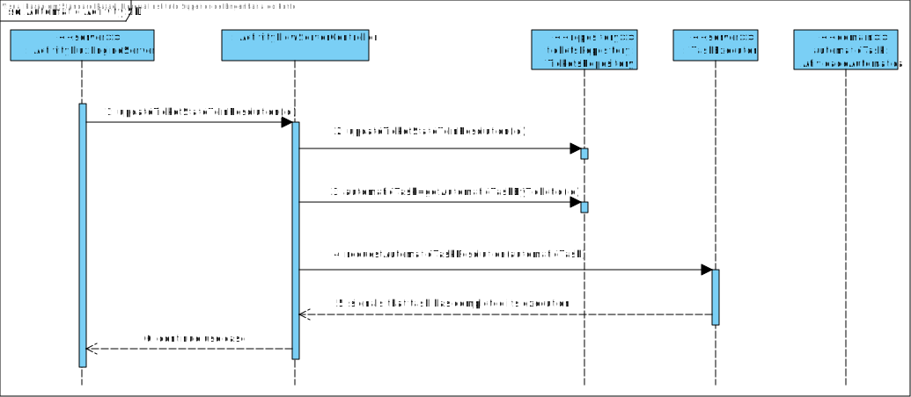
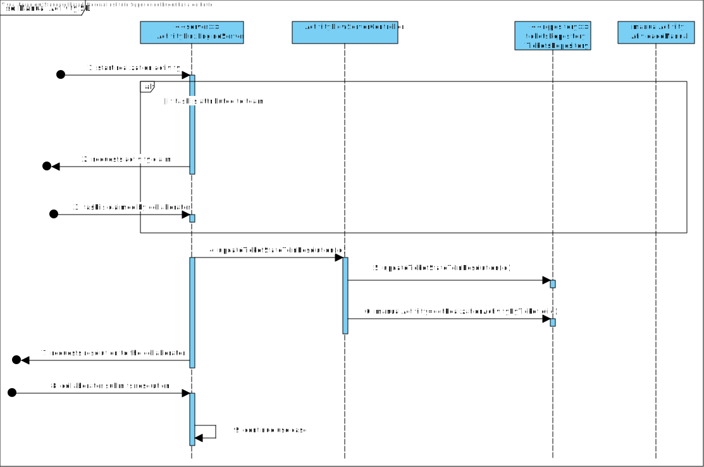

# US4001
=======================================

# 1. Requisitos

Como requisitado, é necessário a existência de um motor responsável por gerir o estado do fluxo de atividades dos vários pedidos. Este motor será localizado num servidor próprio para permitir uma maior flexibilidade e performance na resolução das tarefas, usando o protocolo tcp.

# 2. Análise

Este servidor comunicará com a base de dados para obter os dados necessários à conclusão das várias tarefas. 
Por sua vez, o servidor delegará as tarefas às entidades responsáveis pela determinação das mesmas e aguardará uma resposta para alterar o estado atual do fluxo e persistir este na base de dados.  

Relativamente às tarefas manuais, será um colaborador o responsável pela sua solução; em referências às atividades automáticas, estas serão delegadas a um executor, localizado noutro servidor.

Todas as ligações seguem o protocolo TCP.

# 3. Design

## 3.1. Realização da Funcionalidade

### SD Principal

## Interaction Use da atividade de aprovação

## Interaction Use da atividade de Realização Automática

## Interaction Use da atividade de Realização Manual

##  3.2. Padrões Usados

Como vão existir várias versões do protocolo, foi aplicado o padrão factory juntamente com o strategy para a instanciação da classe respetiva a cada versão do protocolo. A dependência do controller é injetada aquando da criação da instância, sendo esta passada para a fábrica.
