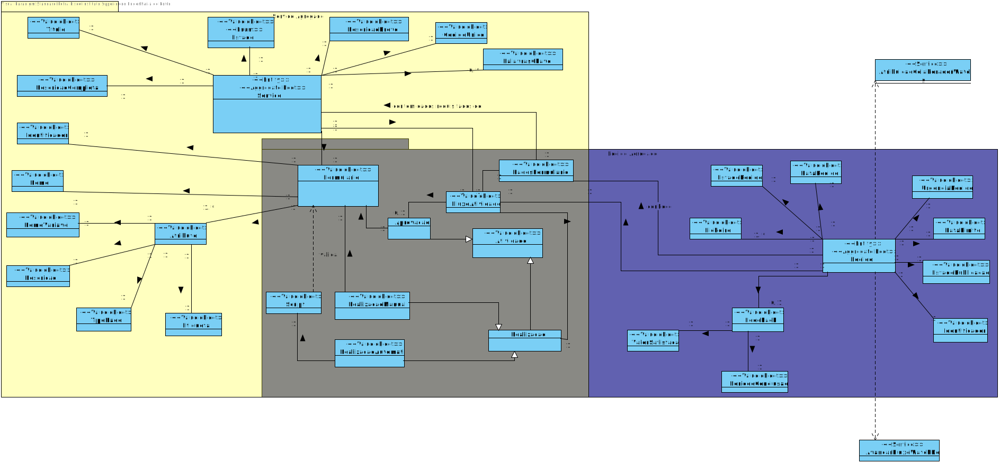
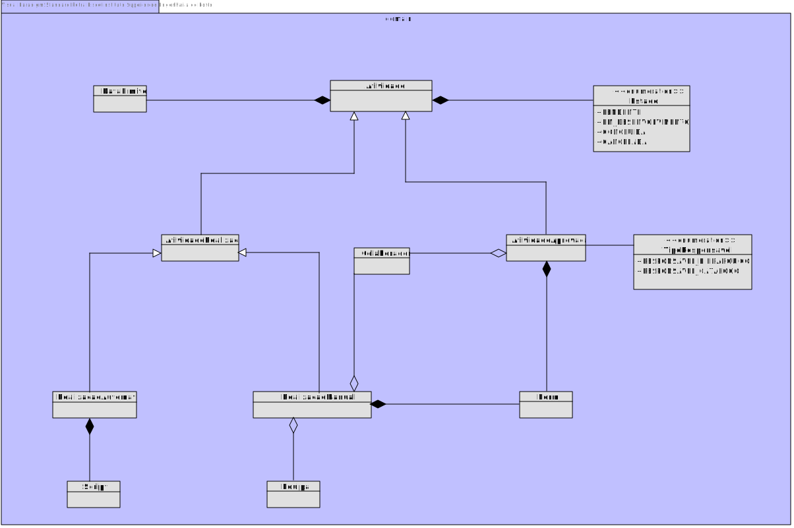

# US1005
=======================================

# 1. Requisitos

**US1005** Como Gestor de Projeto, eu pretendo que seja desenvolvida a componente representativa de uma tarefa manual dedicada à apresentação e recolha de informação a/de um utilizador no âmbito de um pedido e que a mesma seja adicionada à biblioteca de atividades típicas do sistema para, dessa forma, poder ser usada na definição de fluxos de atividades.

# 2. Análise

## 2.1. Excerto de Modelo de Domínio

# 3. Design

## 3.1. Diagrama de Classes

## 3.2. Padrões Aplicados

|Questão|Resposta (Padrão)|
|:----:|:---------------:|
|Como preparar o código para modificações?|Princípio Open-Close; uma classe deve ser aberta (open) para extensão mas fechada (close) para modificação. De acordo com a hierarquia de classes demonstrada em 3.1, pode destacar-se o recurso a classes abstratas, bem como ao uso de Herança no sentido de aplicar este princípio.| 
|Como reduzir o acoplamento entre as diferentes funcionalidades?|Polimorfismo; um determinado comportamento (método) definido na superclasse pode ser redefinido nas subclasses.|

## 3.4. Testes 

**Teste 1:** Garantir que não é possível inicializar uma Atividade de Realização Manual com valores null

    @Test(expected=IllegalArgumentException.class)
    public void ensureNullIsNotAllowed01() {
    System.out.println("-----Test 1 (null)-----\n");
    RealizacaoManual r = new RealizacaoManual(null);
    }

    @Test(expected=IllegalArgumentException.class)
    public void ensureNullIsNotAllowed02() {
        System.out.println("-----Test 2 (null)-----\n");
        RealizacaoManual r = new RealizacaoManual(null, null);
    }

**Teste 2:** Garantir que não é possível inicializar uma Atividade de Realização Manual com valores a vazio

    @Test(expected=IllegalArgumentException.class)
    public void ensureEmptyIsNotAllowed01() {
        System.out.println("-----Test 1 (empty)-----\n");
        RealizacaoManual r = new RealizacaoManual(new ArrayList<>(),new Form(new Name("test"), new ArrayList<>()));
    }

**Teste 3:** Garantir que a Data Limite é posterior ao dia presente

    @Test(expected=IllegalArgumentException.class)
    public void ensureEmptyIsNotAllowed02() {
        System.out.println("-----Test 2 (empty)-----\n");
        Calendar d = new GregorianCalendar();
        d.set(2023, Calendar.DECEMBER, 12);
        RealizacaoManual r = new RealizacaoManual(EstadoAtividade.valueOf("Pendente"), DataLimite.valueOf(d),
                new ArrayList<>(), new Form(new Name("test"), new ArrayList<>()));
    }

# 4. Implementação

## Domain

Foram criadas na camada de domínio a entidade Realizacao manual e os respetivos Value Objects.

## Application

Criacao da atividade manual no ambito de : 
* SpecifyServiceUIControllerFacade
## Presentation

Nesta camada foi desenvolvida a UI(consola) que faz a interação com o utilizador do sistema para registar atividade manual.

# 5. Integração/Demonstração

* De acordo com as regras de negócio a Atividade e restantes variantes são consideradas Value Objects. Contudo, no contexto do sistema desenvolvido, foram representadas como
Entidades, de forma a ultrapassar as limitações do JPA.
No intuito de, no entanto, se desenvolver uma aplicação o mais próxima possível do pretendido, optou-se por persistir a Atividade em dois níveis:

* Inicialmente, ao nível do Serviço cria-se apenas a estrutura base da Atividade. Isto é, no caso da Atividade de Realização Manual e de aprovacao implica o registo de formularios 
a serem preenchidos pelos colaboradores atribuidos durante o pedido, como também o colaborador a ser associado durante o pedido. 
  
* Como a especificao de atividade manual é durante a especificacao do fluxo de atividades , e sendo esta durante a especificao do servico recorreu-se ao facade para integrar a partilha de informacao entre cada controller.
Sendo que a utilizacao do facade consideralmente a complexidade e acoplamento da classe.

# 6. Observações

* A utilização de dtos para algumas classes usadas de formas a reduzir o acesso da UI a objetos do dominio.

* Uma possível melhoria seria a construção de um Repositório para Atividades. Apesar da solução desenvolvida apresentar maior proximidade ao solicitado, no contexto do
  programa implica uma maior complexidade devido à necessidade de aceder a dois Repositórios distintos.
  

