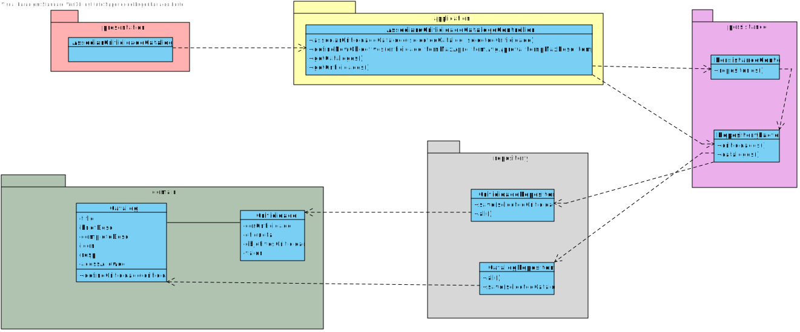

# US 2102 - Atribuir Criticidade a um catálogo de serviços
=======================================

# 1. Requisitos

Como GSH, eu pretendo atribuir o nivel de criticidade aplicado a um catálogo de serviços.

A interpretação feita deste requisito foi no sentido de associar criticidade a um catálogo existente no sistema.

# 2. Análise

O gestor de recursos humanos usa o seu menu para associar criticidade a um catalogo de serviço.

## 2.1 SSD 

## 2.2. Excerto do modelo de domínio

# 3. Design

Para dar resposta a este caso de uso, foi usado o padrão Controller, visto na classe controladora AssociarCriticidadeCatalogoController 
. Este, é responsável pela organização e pelo processo de associaçao de uma criticidade a uma catalogo no sistema, e subsequentemente, na base de dados. O controller usa classe de domain Criticidade e um DTO de um catalogo para criar a instância da mesma. E para a sua persistência na base de dados, conforme referido, é usado o CatalogRepository.É também importante mencionar o facto de ser usado o padrão DTO
para a escolha do catalogo a ser usado para associar. Uma vez que na UI é utilizado o DTO de Catalogo de forma a esconder detalhes da implementação da classe de domínio.

## 3.1. Realização da Funcionalidade

## 3.2. Diagrama de Classes

## 3.3. Padrões Aplicados
*Nesta secção deve apresentar e explicar quais e como foram os padrões de design aplicados e as melhores práticas.*

Questão: Que Classe...|Resposta|Justificação (Padrão)|
|:----:|:---------------:|:-----:|
|é responsável por criar todos as classes Repository?|RepositoryFactory|Factory, quando uma entidade é demasiado complexa, as fábricas fornecem encapsulamento.|
|permite persistir o catalogo criadas? |CatalogoRepository|Repository, quando se pretende ocultar os detalhes de persistência/reconstrução de objetos cria-se uma classe Repository responsável por essas tarefas.|
|conhece todas os catalogos?|CatalogosRepository|Information Expert, dado que é responsável pela persistência/reconstrução da catalogo, conhece todos os seus detalhes.|
|conhece todos as criticidades?|CriticidadesRepository|Information Expert, dado que é responsável pela persistência/reconstrução da Criticidade, conhece todos os seus detalhes.|
|Permite listar todas as criticidades?|ListCriticidadesService|Serviço que tem como funcao permitir a listagem de criticidade.|
|Conhece as informacoes do catalogo?|CatalogoDTO|DTO que tem como funcao esconder os detalhes de implementacao da classe de dominio na UI.|
|Conhece o catalogo proveniente do DTO?|CatalogoDTOParser|Parser que tem como funcao obter o catalogo proveniente do DTO.|

## 3.4. Testes 

**Teste 1:** Verificar que não é possível criar uma instância dos values objects com valores nulos.

	  @Test(expected = IllegalArgumentException.class)
    public void ensureNullIsNotAllowed() {
        EtiquetaCriticidade local = new EtiquetaCriticidade(null);
    }

**Teste 2:** Verificar que não é possível criar uma instância dos values objects com string vazias

	   @Test(expected = IllegalArgumentException.class)
    public void ensureEmptyIsNotAllowed() {
        EtiquetaCriticidade local = new EtiquetaCriticidade("    ");
    }

**Teste 3:** Verificar que não é possível criar uma instância dos values objects a ultrapassar o tamanho exigido

	@Test(expected = IllegalArgumentException.class)
    public void ensureSizeAllowed() {
        EtiquetaCriticidade local = new EtiquetaCriticidade(" aaaaaaaaaaaaaaaaaaaaaaaaaaaaaaaaaaaaaaaaaaaaaaaaaaaaaa   ");

**Teste 4:** Verificar que não é possível criar uma instância dos  objetivos a com minutos negativos

    @Test(expected = IllegalArgumentException.class)
    public void ensureCorrectValuesIsNotAllowed() {
        ObjetivosCriticidade ob = new ObjetivosCriticidade(-1,-1,-1,-1);
    }

**Teste 5:** Verificar que não é possível criar uma instância do valor da criticidade com valor negativo.

      @Test(expected = IllegalArgumentException.class)
    public void ensureNegativeValueIsNotAllowed() {
        ValorCriticidade ob = new ValorCriticidade(-1);
    }

**Teste 6:** Verificar que não é possível criar uma instância do valor da criticidade com valor acima de permitido.

    @Test(expected = IllegalArgumentException.class)
    public void ensureHighValuesIsNotAllowed() {
        ValorCriticidade ob = new ValorCriticidade(102);
    }

**Teste 7:** Verificar que não é possível criar uma instância da classe Title com valor nulo.

	@Test(expected = IllegalArgumentException.class)
    public void ensureNullIsNotAllowed() {
        Title title = new Title(null);
    }

**Teste 8:** Verificar que não é possível criar uma instância da classe BriefDescription com String vazia.

	@Test(expected = IllegalArgumentException.class)
    public void ensureEmptyIsNotAllowed() {
        BriefDescription briefDesc = new BriefDescription("");
    }

**Teste 9:** Verificar que não é possível criar uma instância da classe CompleteDescription com tamanho maior que 100.

	@Test(expected = IllegalArgumentException.class)
    public void ensureLengthIsLess100() {
        StringBuilder builder = new StringBuilder();
        for (int i = 0; i < 105; i++) builder.append("a");
        CompleteDescription desc = new CompleteDescription(builder.toString());
    }

Para além destes, foram desenvolvidos testes para verificar igualdade de ValueObjects (também no Icon):

**Teste 10:** Verificar que duas instâncias de Icon são iguais.

	@Test
    public void ensureTwoTitlesAreEqual() {
        Icon icon1 = new Icon(new byte[] {1,2,3});
        Icon icon2 = new Icon(new byte[] {1,2,3});
        assertEquals(icon1, icon2);
    }

**Teste 11:** Verificar que duas instâncias de Icon são diferentes.

	@Test
    public void ensureTwoTitlesAreDifferent() {
        Icon icon1 = new Icon(new byte[] {1,2,3});
        Icon icon2 = new Icon(new byte[] {1});
        assertNotEquals(icon1, icon2);
    }

Na entidade Catalog foram criados testes para validar os parâmetros.

**Teste 12:** Verificar que não pode ser criada uma instância de Catalog com parâmetros nulos.

	@Test(expected = IllegalArgumentException.class)
    public void ensureNullParameterIsNotAllowed() {
        Catalog catalog = new Catalog((Title) null, null, null, null, null, null);
    }

# 4. Implementação

Na camada de domínio, foi usada as classes de domínio criticidade e catalogo, e usando o DTO do catalogo.

## Application

Nesta camada foi desenvolvido o Controller de associar criticidade ao catalogo. AssociarCriticidadeCatalogoController e ListCriticidadeService.

## Presentation

Nesta camada foi desenvolvida a UI (consola) que faz a interação com o utilizador do sistema para associar criticidade ao catalogo.
Tendo em conta a utilização do DTO do catalogo para impedir que a UI tenha acesso direto a classe de dominio,

# 5. Integração/Demonstração

O colaborador a utilizar a aplicacao seja o Gestor de servicos help desk , exigindo que já exista criticidades e catalogos registados no sistema.

# 6. Observações

~~Seria melhor usar o dto de catalogo em vez do objeto de dominio de forma a seguir com o lecionado.~~
(Correcao realizada no sprint D)

