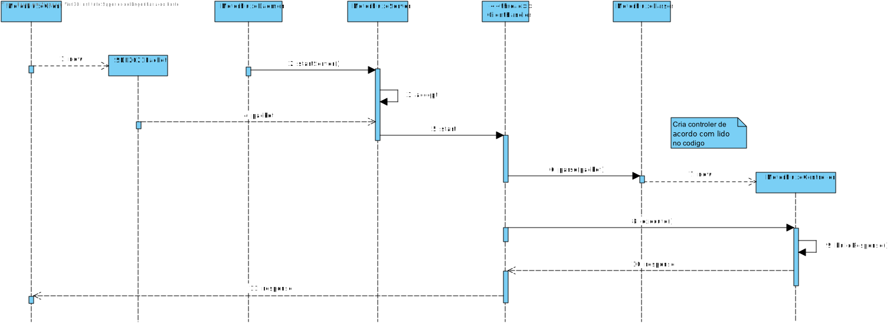
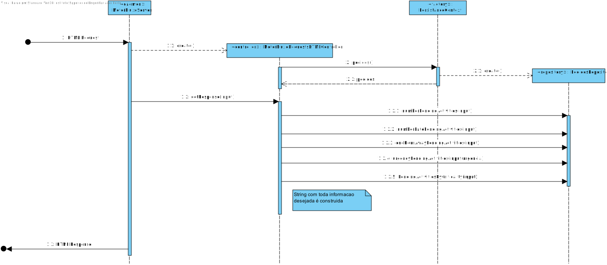

# US4002
=======================================

# 1. Requisitos

Como requisitado, é necessário a existência de um motor responsável por gerir o estado do fluxo de atividades dos vários pedidos. Este motor será localizado num servidor próprio para permitir uma maior flexibilidade e performance na resolução das tarefas.

Num primeiro momento o servidor irá receber pedidos para obter informação das atividades que os colaboradores logado tem para fazer.

Este servidor, por sua vez, comunicará com a base de dados para obter os dados necessários para a dashboard html da aplicacao Portal dos utilizadores. 
Com a informação obtida o motor de fluxo irá enviar as informações pretendidas ao socket apropriado.

Todas as ligações seguem o protocolo SDP2021 especificado.

# 3. Design

## 3.1. Protocolo de Comunicação

O protocolo de comunicação de aplicação a utilizar denomina-se Service Desk Protocol2021 (SDP 2021) e
tem por objetivo garantir a transação de dados entre as aplicações preconizadas no sistema.
A transação de dados é realizada através de uma ligação TCP, segundo
o modelo cliente-servidor, implicando sempre o envio de uma mensagem de pedido, seguido da receção de uma
mensagem de resposta.

O Motor de fluxo atividades atua como Servidor, pelo que:

* Deve aceitar pedidos de ligação TCP no port 32507;
* Deve enviar mensagens de resposta aos pedidos recebidos;

A ligação TCP deve:

* Persistir apenas durante a execução de cada tarefa automática;
* Uma vez terminada a execução da tarefa:
    1. O Servidor deve enviar feedback ao cliente
    2. O Cliente deve solicitar o fim da ligação
  
###Funcionamento do motor de fluxo

### Tratamento de um pedido de HTML

# 4. Implementação

# 5. Integração/Demonstração

# 6. Observações

