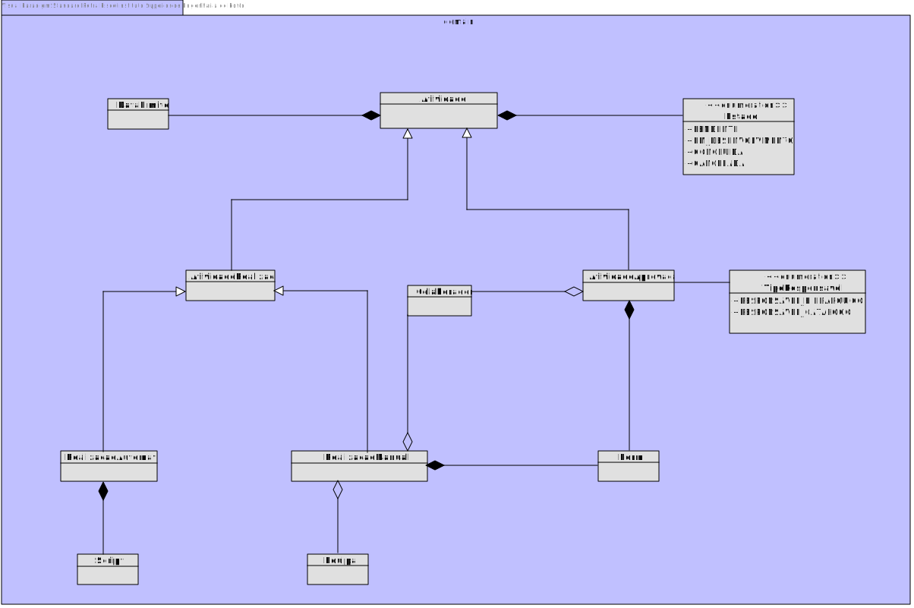

# US1006  
=======================================

# 1. Requisitos

*Nesta secção a equipa deve indicar a funcionalidade desenvolvida bem como descrever a sua interpretação sobre a mesma e sua correlação e/ou dependência de/com outros requisitos.*

**US1006** Como Gestor de Projeto, eu pretendo que seja desenvolvida a componente representativa de uma tarefa automática dedicada à execução de um script no âmbito de um pedido e que a mesma seja adicionada à biblioteca de atividades típicas do sistema para, dessa forma, poder ser usada na definição de fluxos de atividades.

# 2. Análise

## 2.1. Excerto de Modelo de Domínio

# 3. Design

## 3.1. Diagrama de Classes

## 3.2. Padrões Aplicados

|Questão|Resposta (Padrão)|
|:----:|:---------------:|
|Como preparar o código para modificações?|Princípio Open-Close; uma classe deve ser aberta (open) para extensão mas fechada (close) para modificação. De acordo com a hierarquia de classes demonstrada em 3.1, pode destacar-se o recurso a classes abstratas, bem como ao uso de Herança no sentido de aplicar este princípio.| 
|Como reduzir o acoplamento entre as diferentes funcionalidades?|Polimorfismo; um determinado comportamento (método) definido na superclasse pode ser redefinido nas subclasses.|

## 3.4. Testes 
*Nesta secção deve sistematizar como os testes foram concebidos para permitir uma correta aferição da satisfação dos requisitos.*

**Teste 1:** Garantir que não é possível inicializar uma Atividade de Realização Automática com valores null

    @Test(expected=IllegalArgumentException.class)
    public void ensureNullIsNotAllowed() {
        System.out.println("-----Test 1 (null)-----\n");
        RealizacaoAutomatica r = new RealizacaoAutomatica(null, null, null);
        RealizacaoAutomatica r1 = new RealizacaoAutomatica(null);
    }

**Teste 2:** Garantir que o Script não é nulo

    @Test(expected=IllegalArgumentException.class)
    public void ensureNullIsNotAllowed() throws IOException {
        System.out.println("-----Test 1 (null)-----\n");
        Script s = new Script(null);
    }

**Teste 3:** Garantir que a Data Limite é posterior ao dia presente

    @Test(expected=IllegalArgumentException.class)
    public void ensureTodayOrBeforeIsNotAllowed(){
        System.out.println("-----Test 2 (date -> must be after today)-----\n");
        date.set(2021, Calendar.FEBRUARY,10);
        DataLimite d = new DataLimite(date);
    }

# 4. Implementação

## Domain

No âmbito da Atividade de Realização Automática criou-se a Entidade RealizacaoAutomatica e o Value Object Script em adição aos value objects previamente herdados (ex. EstadoAtividade).

## Application

Criação da Atividade de Realização Automática no âmbito de:

* SpecifyServiceController
* SolicitarServicoController

## Presentation

Desenvolvimento da UI (consola) que garante a interação do utilizador com o sistema no âmbito do registo da Atividade Automática.

# 5. Integração/Demonstração

De acordo com as regras de negócio a Atividade e restantes variantes são consideradas Value Objects. Contudo, no contexto do sistema desenvolvido, foram representadas como
 Entidades, de forma a ultrapassar as limitações do JPA.
No intuito de, no entanto, se desenvolver uma aplicação o mais próxima possível do pretendido, optou-se por persistir a Atividade em dois níveis:

* Inicialmente, ao nível do Serviço cria-se apenas a estrutura base da Atividade. Isto é, no caso da Atividade de Realização Automática implica apenas 
a identificação do diretório onde se localiza o ficheiro Script por forma a armazenar o seu conteúdo;
  
* Posteriormente, ao nível do Pedido cria-se a Atividade em si, inicia o ciclo de vida concreto da mesma. Isto é, no caso da Atividade de Realização Automática 
implica a definição da data limite para a sua resolução e da definição do Estado da mesma;

# 6. Observações

~~* Uma possível melhoria seria a construção de um Repositório para Atividades. Apesar da solução desenvolvida apresentar maior proximidade ao solicitado, no contexto do
 programa implica uma maior complexidade devido à necessidade de aceder a dois Repositórios distintos.~~
  
~~* Outra melhoria implicará uma possível alteração ao nível do Script, dado que para o presente Sprint o Script ainda não se encontra totalmente implementado no âmbito da
 US5001, que prevê a possibilidade de ser apenas efetuada uma simulação do seu funcionamento. Dada a conversão do conteúdo do script para um array de bytes e o seu subsequente 
  armazenamento na base de dados sob essa forma, poderá, eventualmente, haver incompatibilidade aquando da sua integração com ANTLR.~~

