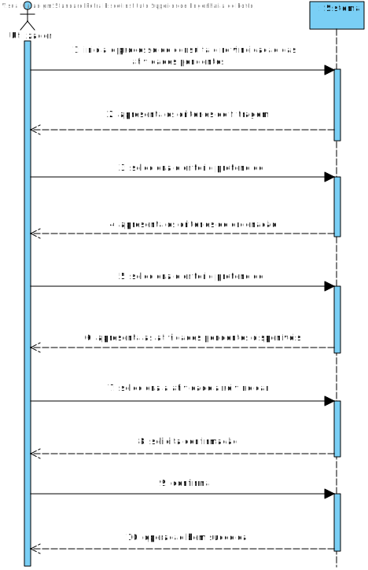
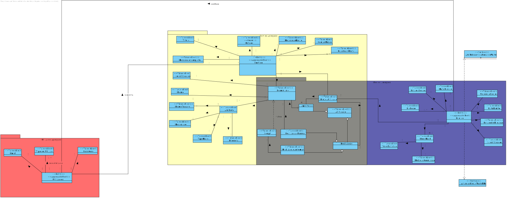
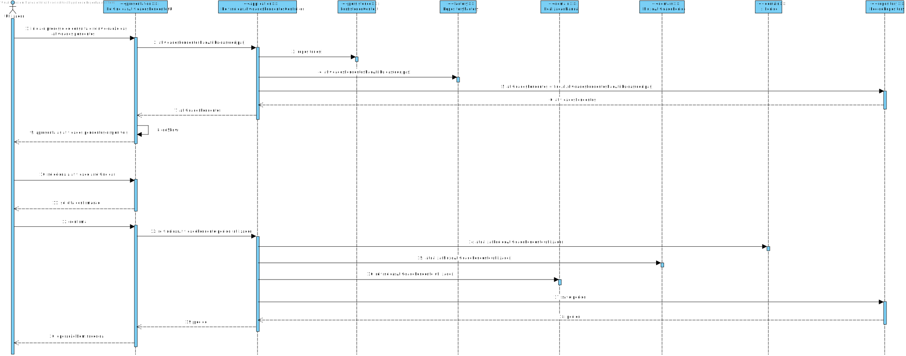
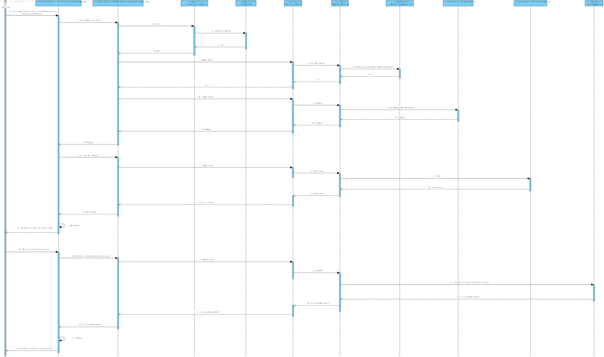
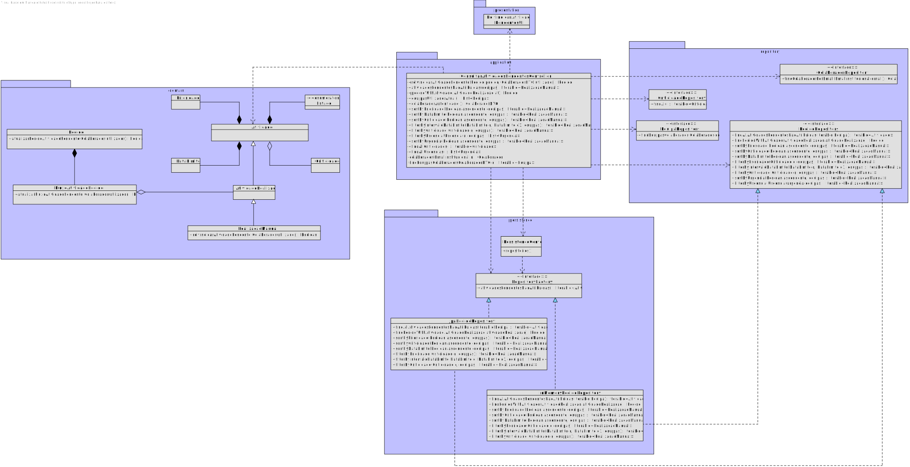

# US3022
=======================================

# 1. Requisitos

**US3022** Como utilizador, eu pretendo consultar as tarefas pendentes que eu posso reivindicar para mim e, caso o deseje, concretize essa reivindicação.

- Dado que sou Utilizador quando consulto as tarefas pendentes pretendo conseguir filtrar/(re)ordenar as mesmas de acordo com os critérios existentes para que possa
  encontrar mais facilmente a atividade pretendida.

# 2. Análise

## 2.1. SSD

## 2.2. Excerto MD

# 3. Design

## 3.1. Realização da Funcionalidade
A realização desta funcionalidade prevê a filtragem / ordenação segundo um conjunto de critérios.
Desta forma, estabeleceu-se que:

* **Critérios de filtragem:**
  1. Criticidade
  2. Data Limite
  3. Urgência

* **Critérios de ordenação:**
  1. Criticidade
  2. Data Limite
  3. Urgência
  4. Prioridade

Para simplificação do SD optou-se por omitir os passos 2 a 5 presentes no SSD - relativos a ordenação e filtragem dos dados.
**Nota:** o método atividadesPendentesNaoAtribuidas() referido no diagrama principal, é invocado apenas no caso de se optar por não se proceder a qualquer filtragem ou ordenação das atividades pendentes.

No SD secundário (abaixo apresentado) descrevem-se com detalhe os passos efetuados para a determinação das atividades pendentes que o Colaborador autenticado pode reivindicar,
bem como, os passos necessários para a filtragem segundo um critério (Criticidade) e a ordenação segundo outro critério (Prioridade). Para os restantes critérios procedeu-se de forma análoga.

## 3.2. Diagrama de Classes

## 3.3. Padrões Aplicados

|Questão: Que Classe...|Resposta|Justificação (Padrão)|
|:----:|:---------------:|:-----:|
|é responsável por criar todos as classes Repository?|RepositoryFactory|Factory, quando uma entidade é demasiado complexa, as fábricas fornecem encapsulamento.|
|permite persistir as tarefas modificadas? |PedidoRepository|Repository, quando se pretende ocultar os detalhes de persistência/reconstrução de objetos cria-se uma classe Repository responsável por essas tarefas.|
|conhece todas as atividades pendentes?|PedidoRepository|Information Expert, dado que é responsável pela persistência/reconstrução da Atividade, conhece todos os seus detalhes.|
|é responsável por coordenar o Caso de Uso?|ConsultarTarefasPendentesController|Controller, dado que funciona como intermediário entre as camadas de Domínio e as de Apresentação|
|é responsável por isolar o Domínio da Apresentação?|ColaboradorDTO|DTO, por forma a diminuir o número de invocações de métodos e esconder detalhes da camada de Domínio, recorre-se a um objeto que contém toda a informação necessária a apresentar.|

## 3.4. Testes
**Teste 1:** Garantir que não é possível inicializar uma Atividade de Realização Manual com valores null

    @Test(expected=IllegalArgumentException.class)
    public void ensureNullIsNotAllowed01() {
    System.out.println("-----Test 1 (null)-----\n");
    RealizacaoManual r = new RealizacaoManual(null);
    }

    @Test(expected=IllegalArgumentException.class)
    public void ensureNullIsNotAllowed02() {
        System.out.println("-----Test 2 (null)-----\n");
        RealizacaoManual r = new RealizacaoManual(null, null);
    }

**Teste 2:** Garantir que não é possível inicializar uma Atividade de Realização Manual com valores a vazio

    @Test(expected=IllegalArgumentException.class)
    public void ensureEmptyIsNotAllowed01() {
        System.out.println("-----Test 1 (empty)-----\n");
        RealizacaoManual r = new RealizacaoManual(new ArrayList<>(),new Form(new Name("test"), new ArrayList<>()));
    }

# 4. Implementação
* Desenvolvimento inicial das queries para ordenação e filtragem: https://bitbucket.org/Eduardooolol/lei20_21_s4_2di_02/commits/28243dc5718618aed3deeaa26c6291c28d64bf6b
* Desenvolvimento inicial da UI: https://bitbucket.org/Eduardooolol/lei20_21_s4_2di_02/commits/5247e800d8b9bd37d1c45d1f9923f52318421115

Apesar destes terem sido os commits mais relevantes para o caso de uso ambos sofreram significativas correções posteriormente.

# 5. Integração/Demonstração

* Considerando que todos os elementos do grupo eram responsáveis por uma User Story que direta ou indiretamente se incluía no âmbito das Atividades, a anteceder o desenvolvimento da User Story
  foi realizada uma reunião na qual se discutiram detalhes acerca da estruturação da Atividade e conceitos relacionados quer ao nível do Modelo de Domínio quer ao nível da implementação.

# 6. Observações

