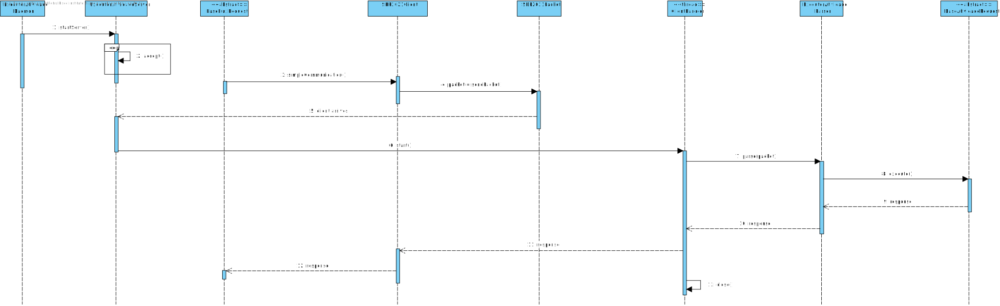

# US5001
=======================================

# 1. Requisitos

**US5001** Como Gestor de Projeto, eu pretendo que seja desenvolvido o Executor de Tarefas Automáticas.

- Como Gestor do Projeto quando se desenvolver o Executor de Tarefas Automáticas pretendo que seja usado o protocolo de aplicação fornecido (SDP2021).

- Como Gestor do Projeto quando se desenvolver o Executor de Tarefas Automáticas pretendo que seja suportado o processamento simultâneo de pedidos para execução de tarefas automáticas.

# 2. Análise

De acordo com a informação disponibilizada pretende-se que o Executor de Tarefas Automáticas permita:

* Garantir a transação de dados entre as diferentes aplicações do Sistema
* Simular a execução de Tarefas/Atividades Automáticas

# 3. Design

## 3.1. Protocolo de Comunicação
O protocolo de comunicação de aplicação a utilizar denomina-se Service Desk Protocol2021 (SDP 2021) e
tem por objetivo garantir a transação de dados entre as aplicações preconizadas no sistema.
A transação de dados é realizada através de uma ligação TCP, segundo
o modelo cliente-servidor, implicando sempre o envio de uma mensagem de pedido, seguido da receção de uma
mensagem de resposta.
O Executor de Atividades Automáticas atua como Servidor, pelo que:

* Deve aceitar pedidos de ligação TCP no port 32507;
* Deve enviar mensagens de resposta aos pedidos recebidos;

A ligação TCP deve:

* Persistir apenas durante a execução de cada tarefa automática;
* Uma vez terminada a execução da tarefa:
    1. O Servidor deve enviar feedback ao cliente
    2. O Cliente deve solicitar o fim da ligação

### 3.1.1. Formato Mensagens

    «versão»«código»«tamanho»<<conteúdo>>

#### Códigos

Em adição aos códigos predefinidos abaixo representados:

|Código Predefinido | Significado |
|:-----------------:|:------------:|
|0| Teste |
|1| Fim |
|2| Entendido |
|255| Segmento |

Para a presente User Story adicionou-se também:

|Código | Significado |
|:-----------------:|:------------:|
|5| Script - identifica os dados transportados como sendo relativos ao Script da Atividade Automática |

# 3.2. SD

A responsabilidade foi assignada a uma nova aplicação (`ExecutorAtividadeDaemon`) dado que todas as aplicações existentes
visam a interação com o utilizador, enquanto que esta não necessita intervenção do mesmo.  
Devido à especificidade desta funcionalidade existem muitas responsabilidades a ser distribuídas entre os diferentes objetos, nomeadamente:

- server socket
- conexão do cliente (numa thread diferente)
- construção da mensagem
- parse das mensagens
- execução do request

# 4. Implementação

## 4.1. Scripts Execução do Servidor
Foram desenvolvidos 2 scripts para a execução do Servidor Executor Atividades Automáticas.

* run-executor-srv.bat
* run-executor-srv.sh

# 5. Integração/Demonstração

Dado o facto do Motor de Fluxo funcionar como Cliente do Servidor Executor de Atividades foi necessária uma comunicação regular por forma a desenvolver o 
servidor de modo a ser capaz de interpretar o request enviado pelo cliente.

# 6. Observações

~~A User Story não foi totalmente implementada, conforme descrito na mesma, optou-se por permitir apenas a simulação da execução do Script.~~

