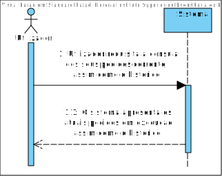
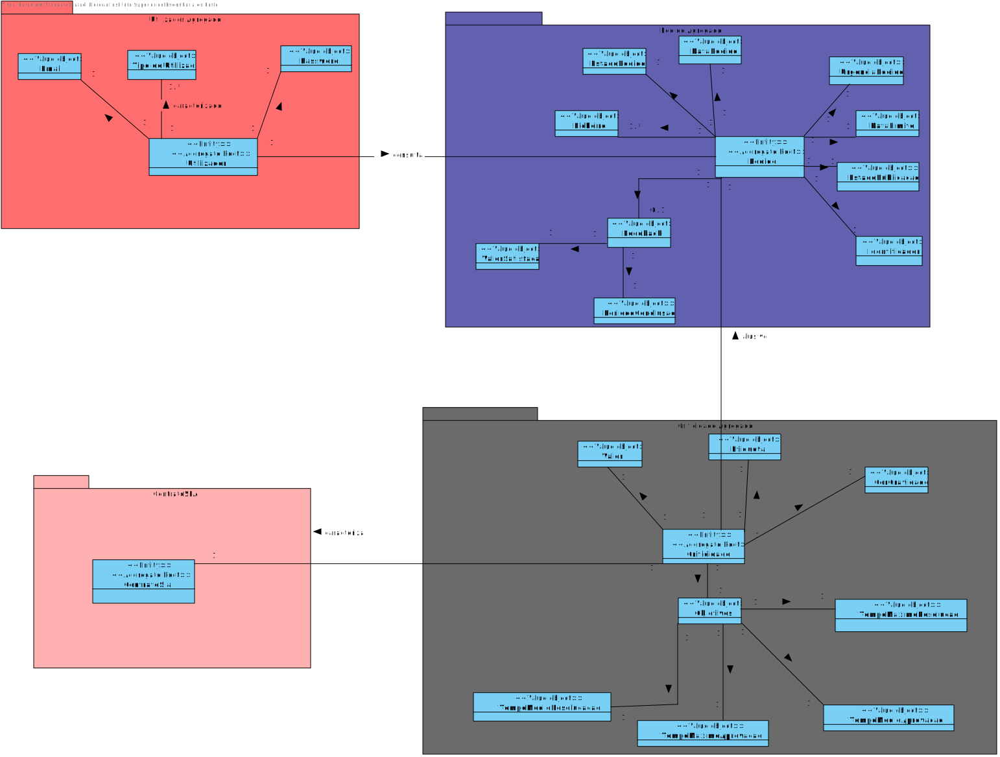
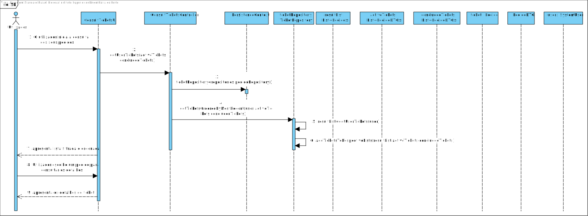
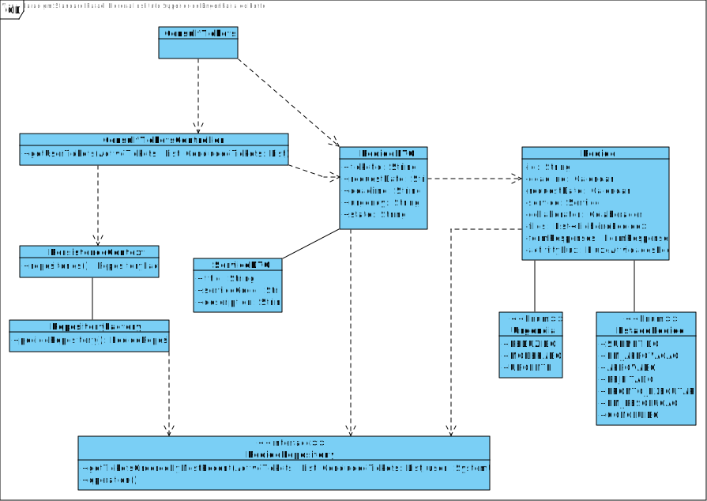

# US3021  - Consultar as tarefas pendentes
=======================================

# 1. Requisitos

Como  utilizador, eu pretendo consultar os meus pedidos (em curso ou o histórico) e  respetivos detalhes/estado.

Separados  entre (i) em curso e (ii) histório. Devem estar ordenados dos mais recentes  para os mais antigos.

# 2. Análise

**Pré-condições**

- User estar registado no sistema

### SSD

### MD

Dado que os dados apresentados devem estar ordenados, esta ordenação será inserida diretamente na query à base de dados.

# 3. Design

## 3.1. Realização da Funcionalidade

De forma a otimizar os recursos, a ordenação e filtragem dos dados será feita diretamente na base de dados. Será feito uma única query para os pedidos em execução e concluídos do utilizador.

Existirão duas listas, passadas por parâmetro, onde uma irá guardar os dados dos pedidos concluídos e a outra dos pedidos em execução, respetivamente.

Após os pedidos serem obtidos da base de dados, estes serão adicionados à sua lista respetiva e os dados serão apresentados ao utilizador.

## 3.2. Diagrama de Sequência

## 3.2. Diagrama de Classes

**

## 3.3. Padrões Aplicados

- DTO
- Factory

## 3.4. Testes 

**Teste Funcional 1**

1. Correr bootstrap
2. Fazer login com o user eduardoCouto
3. Ir a "Requests > Consult Tickets"
4. Escolher um ticket da lista
5. Verificar que aparece no ecrã informação adicional relativo ao ticket escolhido

**Teste Funcional 2**

1. Correr o bootstrap
2. Executar uma tarefa requisitada pelo user eduardoCouto. Pode ser manual ou automática
3. Certificar que a tarefa foi concluída com sucesso
4. Fazer login com o user eduardoCouto
5. Ir a "Requests > Consult Tickets"
6. Verificar que a tarefa executada aparece na aba de tarefas concluídas

# 4. Implementação

#### 4.1 Commits Relevantes

- Análise: 3eb825c1f37cb2c3c205bab5693df7b83445a601
- Implementação: 0acf79f32e7eeb589589a5cdb011b217714b7ebb
- Review: a215aba7f77b595715de544ba6040333b0b5d50e

# 5. Integração/Demonstração

Esta funcionalidade foi integrada no menu já existente respetivo à requisição de pedidos, de forma a aproveitar partes da aplicação já desenvolvidas e incentivar um uso mais intuitivo da aplicação.

# 6. Observações

-

