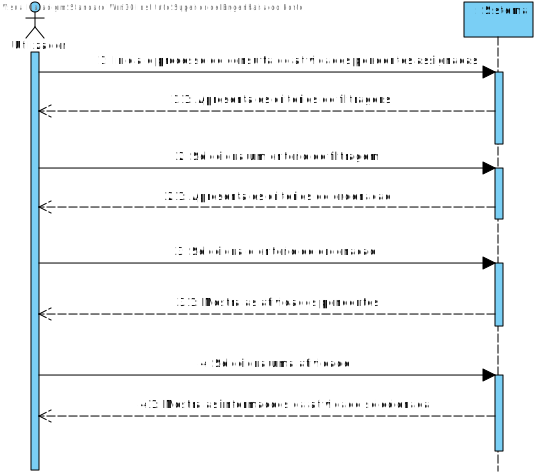
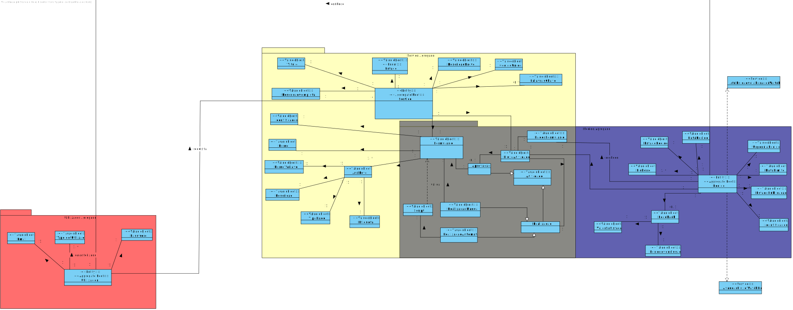
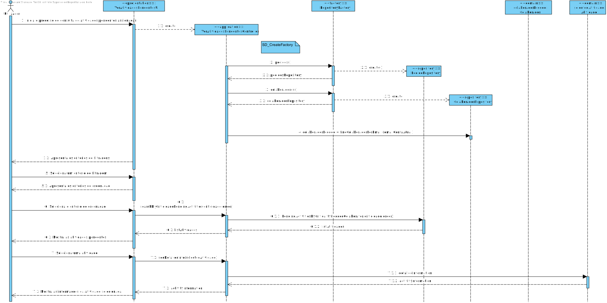
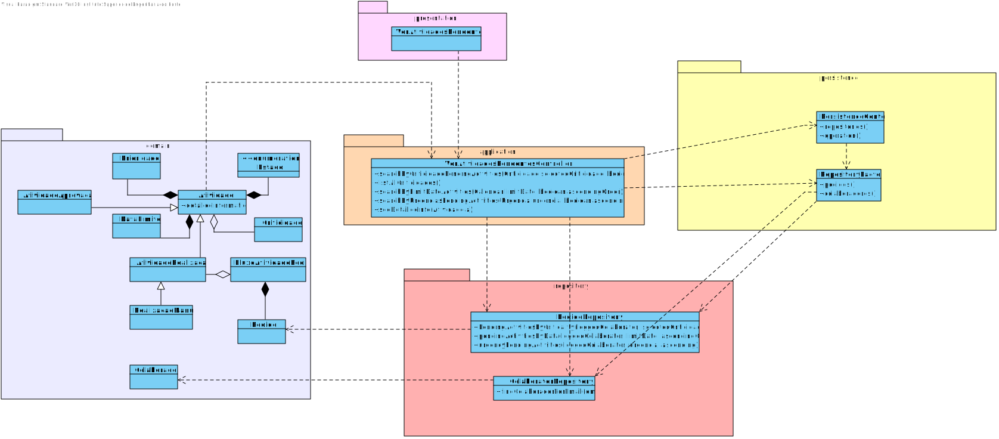

# US3021  - Consultar as tarefas pendentes
=======================================

# 1. Requisitos

Como utilizador, eu pretendo consultar as tarefas pendentes que me estão assignadas.

- Dado que sou Utilizador quando consulto as tarefas pendentes pretendo conseguir filtrar/(re)ordenar as mesmas de acordo com os critérios existentes para que possa
  encontrar mais facilmente a atividade pretendida.

# 2. Análise

## 2.1. SSD

## 2.2. Excerto MD

# 3. Design

## 3.1. Realização da Funcionalidade

**Nota:** o método searchByCriticidadePendingActivities(criticidade,order) referido no diagrama principal, é invocado apenas no caso de se optar por se escolher criticidade como forma de filtrar 
no entanto independente de qualquer filtragem ou ordenação das atividades pendentes a ideia será a mesma , apenas sendo invocado métodos diferentes para os outros tipos de filtracao , sendo estes
searchByUrgenciasPendingActivities(criticidade,order) e searchByLimitDateActivities(criticidade,order)

## 3.2. Diagrama de Classes

## 3.3. Padrões Aplicados

Questão: Que Classe...|Resposta|Justificação (Padrão)|
|:----:|:---------------:|:-----:|
|é responsável por criar todos as classes Repository?|RepositoryFactory|Factory, quando uma entidade é demasiado complexa, as fábricas fornecem encapsulamento.|
|conhece todas as atividades?|PedidosRepository|Information Expert, dado que é responsável pela persistência/reconstrução do Pedido e Atividades, conhece todos os seus detalhes.|
|conhece todos as criticidades?|CriticidadesRepository|Information Expert, dado que é responsável pela persistência/reconstrução da Criticidade, conhece todos os seus detalhes.|
|conhece todos as colaborador?|ColaboradorRepository|Information Expert, dado que é responsável pela persistência/reconstrução da Colaborador, conhece todos os seus detalhes.|
|é responsável pela listagem das criticidades| ListCriticidadesService | Service , objeto que realiza a operacao e coordena os objetos de dominio necessarios .|
|é responsável por coordenar o Caso de Uso?|VerAtividadesPendentesController|Controller, dado que funciona como intermediário entre as camadas de Domínio e as de Apresentação|

## 3.4. Testes

**Teste 1:** Garantir que não é possível inicializar uma Atividade de Realização Manual com valores null

    @Test(expected=IllegalArgumentException.class)
    public void ensureNullIsNotAllowed01() {
    System.out.println("-----Test 1 (null)-----\n");
    RealizacaoManual r = new RealizacaoManual(null);
    }

    @Test(expected=IllegalArgumentException.class)
    public void ensureNullIsNotAllowed02() {
        System.out.println("-----Test 2 (null)-----\n");
        RealizacaoManual r = new RealizacaoManual(null, null);
    }

**Teste 2:** Garantir que não é possível inicializar uma Atividade de Realização Manual com valores a vazio

    @Test(expected=IllegalArgumentException.class)
    public void ensureEmptyIsNotAllowed01() {
        System.out.println("-----Test 1 (empty)-----\n");
        RealizacaoManual r = new RealizacaoManual(new ArrayList<>(),new Form(new Name("test"), new ArrayList<>()));
    }

# 4. Implementação

## Domain

Na camada de domínio, nao foi alternado nada relativamente ao ultimo sprint , apenas foram adicionados alguns testes para as classes de Atividade.

## Application

Foi desenvolvido o controller que comunica com a UI , sendo que a sua funcao grande partes das vezes era retornar resultados de queries necessarios para a UI.

## Presentation

Nesta camada foi desenvolvida a UI (consola) que faz a interação com o utilizador do sistema , dando enfase em grande parte a utilizacao dos menu e submenus 
utilizados na framework de forma que o codigo fosse menos redudante devido ao grande numéro de menus usados.

# 5. Integração/Demonstração

De forma a usufruir dos resultados das atividades , é necessário que o colaborador logado já possua atividades pendentes para a realizacao.
Caso este nao tenha , este nao ira conseguir ver nenhuma informacao ou utilizar este user story.

# 6. Observações

A unica melhoria relevante seria a utilização de DTO para atividades, no entanto, devido o grande esforço requerido por um DTO e como o grupo no conjunto
concordou nao utilizar DTO para atividades, entao a UI tinha acesso a um objeto de dominio , que vai contra as boas práticas da programação.

