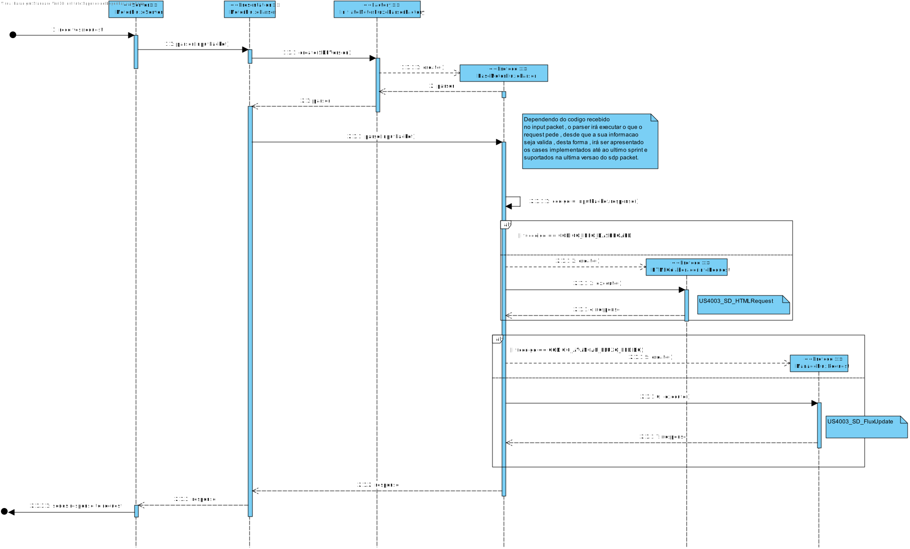
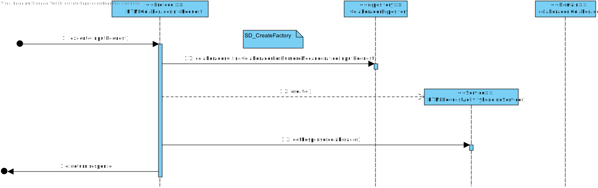
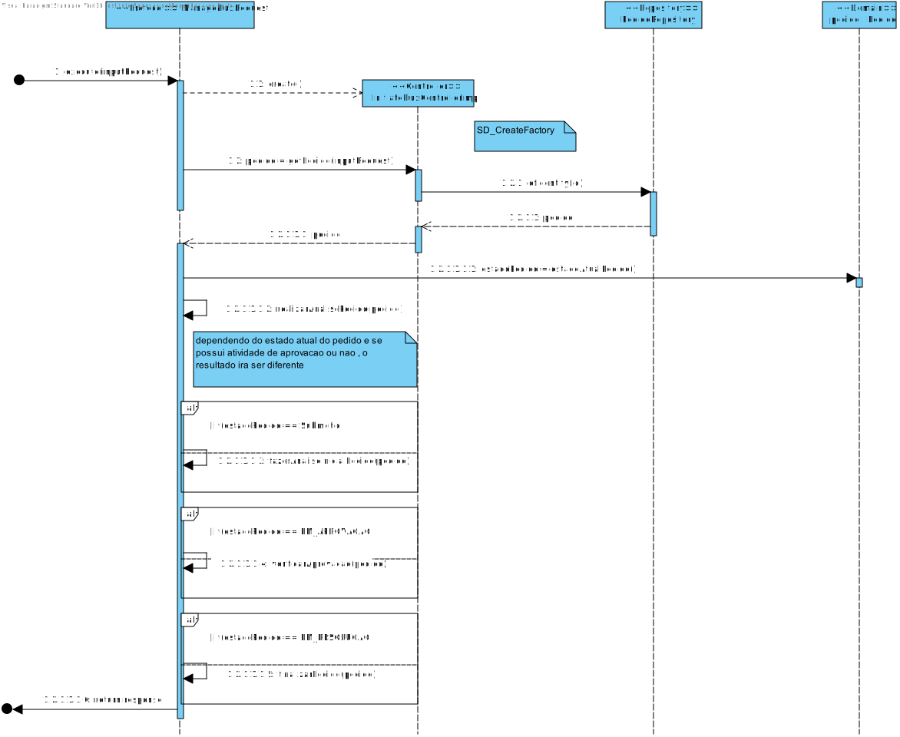

# US4003 - Finalizar Desenvolvimento do motor de fluxo de atividades
=======================================

# 1. Requisitos

Como Gestor de Projeto, eu pretendo que a equipa conclua o desenvolvimento do motor de fluxos de atividades tornando-o bastante robusto.

A interpretação feita deste requisito foi no sentido que o sistema robustamente tem de responder aos pedidos que cheguem ao mesmo.

# 2. Análise

Como requisitado anteriormente, é necessário a existência de um motor responsável por gerir o estado do fluxo de atividades dos vários pedidos e disponibilize, a pedido, os dados necessários às aplicações Serviços e RH e Portal dos Utilizadores.

Este motor será localizado num servidor próprio para permitir uma maior flexibilidade e desempenho na resolução das tarefas, usando o protocolo tcp sendo que este também usa o protocolo tsl de forma a garantir a segurança na troca de dados.

Este servidor comunicará com a base de dados para obter os dados necessários para responder às requests. 
No que lhe concerne, o servidor delegará as tarefas às entidades responsáveis pela determinação das mesmas e aguardará uma resposta para alterar o estado atual do fluxo e persistir este na base de dados.

Relativamente às tarefas manuais, será um colaborador o responsável pela sua solução, sendo que este colaborador pode ser delegado automaticamente por um de dois algoritmos disponíveis aquando deste ultimo sprint; 
Em referências às atividades automáticas, estas serão delegadas a um executor, localizado noutro servidor,sendo que existe um algoritmo de atribuição de atividades (automaticas) ao executor.

# 3. Design

Como vão existir várias versões do protocolo, foi aplicado o padrão factory juntamente com o strategy para a instanciação da classe respetiva a cada versão do protocolo

Para dar resposta a este caso de uso, como vão existir várias versões do protocolo, foi aplicado o padrão factory juntamente com o strategy para a instanciação da classe respetiva a cada versão do protocolo, implementado na classe InitiateMotorFluxoParserFactory. Este é responsável pela criacao do Parser do motor de fluxo apropriada para a versao do sdp packet sendo implementada nas classes MotorFluxoParserVx(Sendo x a versao do packet a ser utilizada).

O Parser, é responsável pela organização e execução dos serviços necessários de forma a responder ao request, sendo este também um padrão.
Tendo como por exemplo o HTMLColaboradorInfoRequest sendo o serviço responsável pela obtenção das informações,na base de dados, acerca do colaborador de forma a mostrar as mesmas na sua dashboard na web.

Outro exemplo é o ManageFluxRequest sendo que este é responsável por obter informacao do estado do fluxo do pedido recebido pelo packet , e tem de atualizar o seu estado e evoluir de forma robusta. Para tal , é utilizado o pedidoRepository para persistir e obter informações do pedido conforme o necessário.

## 3.1. Realização da Funcionalidade

### SD Principal

## Interaction Use da HTML Request

## Interaction of Analyze flux state

## 3.3. Padrões Aplicados

Factory 
Strategy
Service 
Controller

## 3.4. Testes
*De forma a verificar que o motor de fluxo seguia as regras de négocio realizou-se os seguintes testes.*

**Teste 2 e 3 :** Verificar que se o Servidor avancava o fluxo do pedido.

	  public void testeServidor() throws IOException {
        SDP2021Packet p=new SDP2021Packet ( 0, CODIGO_AVANCAR_FLUXO_PEDIDO,"2021/00001");
        try{
            System.out.println(SDP2021Client.simpleCommunication ( p,"10.8.0.82",31942, "client_mf").response());
        }catch (IOException e){
            System.out.println ("Erro no teste");
        }
    }

    @Test
    public void avancarMotorFluxo() throws IOException {
        SDP2021Packet p=new SDP2021Packet ( 1, CODIGO_AVANCAR_FLUXO_PEDIDO,"2021/00009" );
        try{
        SDP2021Packet packet = SDP2021Client.simpleCommunication ( p,"10.8.0.82",31942, "client_mf");
        String a = packet.response();

            System.out.println(a);
        }catch (IOException e){
            System.out.println ("Erro no teste");
        }

    }

**Teste 2:** Verificar que se o Servidor executava atividade automatica.
    
    @Test
    public void testeExecutor() throws IOException {
        SDP2021Packet p=new SDP2021Packet ( 0,CODIGO_SCRIPT,"Script exemplo" );
        try{
            System.out.println(SDP2021Client.simpleCommunication ( p,"10.8.0.81",31942, "client_exec").response());
        }catch (IOException e){
            System.out.println ("Erro no teste");
        }
    }

# 4. Implementação

## Domain

Foram utilizadas as classes de pedido , fluxo de atividade e atividade , uma vez que a user story manipula no estados das mesmas de forma a poder avancar com elas
ou de forma a devolver informacoes acerca das mesmas

## Protocol

Foi dado deployement no package do protocol as classes que interpretavam os pedidos recebidos no motor de fluxo , de forma a estes poderem 
ser processados e respondidos aos mesmos.

## Repository

Foram utilizados diferentes repositorios de forma a ter acesso a informacao guardada remotamente , sendo esta necessaria para o processamento de pedidos

# 5. Integração/Demonstração

Uma vez que este codigo é implementado para uma maquina remota , aquando de occorrencia de erros e a sua posterior correcao demorava bastante tempo para executar.
Deste forma, a integracao foi bastante dificil devido a fatores externos de dar deployement da solucao desenvolvida.

# 6. Observações

A utilizacao de state patern de forma a evoluir o fluxo seria bastante interessante de implementar de forma a torna-se ainda mais robusta.
