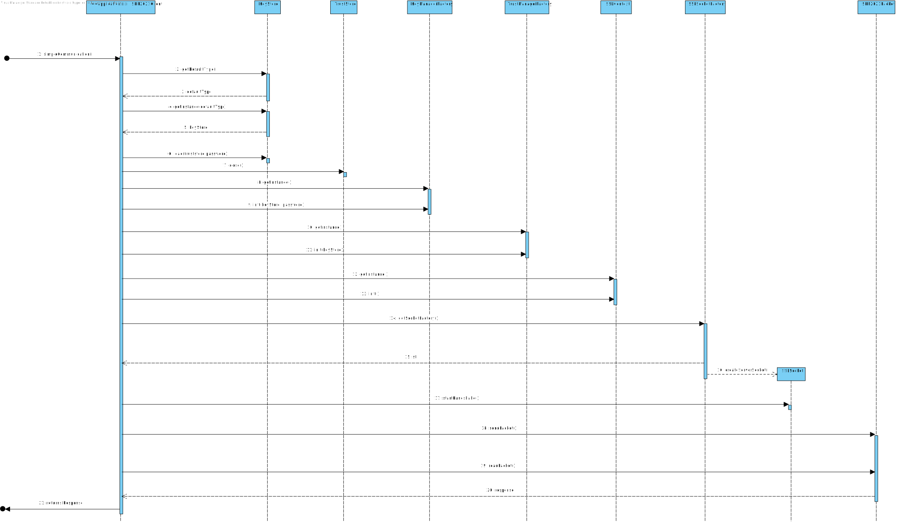

# US4052 Comunicações realizadas como aplicação cliente através do protocolo SDP2021 estejam protegidas.
=======================================

# 1. Requisitos

Como Gestor de Projeto, eu pretendo que as comunicações realizadas como aplicação cliente através do protocolo SDP2021 estejam protegidas.

Critérios de Aceitação:

Aplicar SSL/TLS com autenticação mútua baseada em certificados de chave pública.

A interpretação feita deste caso de uso, foi no sentido de proteger as ligações client-server entre o Cliente e o motor de fluxo. Para isso teremos de recorrer ao protocolo de encriptação, Transport Layer Protocol. Esta adição ao projeto, em nada deve alterar o funcionamento normal do programa, apenas deve proteger a ligação efetuada através de um socket quando as duas partes estabelecem comunicação.

Através do recurso ao SSL/TLS se pretende garantir:

* Autenticação - Garantir que terceiros não podem personificar aplicações lícitas;
* Privacidade - Garantir que terceiros não podem ler a informação;
* Integridade - Garantir que terceiros não podem modificar a informação;

# 2. Análise

As comunicações realizadas entre o cliente e o motor de fluxo deve usar autenticação mútua baseada em certificados de chave pública.

Para a resolução desta funcionalidade, a proteção será protegida nas comunicações TCP. Na cadeia de eventos, que leva à comunicação entre o cliente e o motor de fluxo, já implementada no Sprint anterior, devem ser feitas alterações, para que o socket usado, seja protegido através de TLS/SSL. Para isso será necessário uma Java KeyStore (JKS) em comum, que é essencialmente um repositório de certificados de segurança. Neste sentido, daremos uso a bibliotecas específicas associadas a este protocolo. Começaremos por adicionar às propriedades do sistema os certificados necessários a que o servidor pode confiar por parte de clients autorizados. Será usada a classe SSLServerSocketFactory e será obtida a Server Factory standard, será criada a socket de comunicação, onde a esta, será dito que qualquer client-side que tente a comunicação, necessitará de autenticação.

# 3. Design

Para realizar comunicações entre o cliente e o servidor, é usado a classe "SDP2021Client" , sendo que neste classe possui o método simpleComunication. Neste metodo, serão feitos os setProperty, da informação necessária à comunicação segura entre ambos os lados, conforme descrito na Análise acima. Será usada a classe SSLServerSocketFactory, da biblioteca javax.net.ssl, onde será criado o socket com a porta e o ip através de onde será feita a instauração de comunicação ,Após a ligação ter sido estabelecida com sucesso, o caso de uso adjacente à comunicação por TCP, continua a sua execução conforme a implementação do sprint anterior e ira enviar o que foi passado como parametro para o método em questão.

## 3.1. Realização da Funcionalidade

## 3.2. Padrões Aplicados

| Questão: Que Classe...                                       | Resposta                        | Justificação (Padrão)                                        |
| :------------------------------------------------------------: | :-------------------------------: | :------------------------------------------------------------: |
| é responsável por criar os SSLSocket? | SSLSocketFactory | Factory, quando um conceito é demasiado complexo, as fábricas fornecem encapsulamento. |

## 3.3. Testes 

**Teste 1:** Verificar se é possivel ligar ao motor de fluxo de server pelo lado do cliente.

	 @Test
    public void testeServidor() throws IOException {
        SDP2021Packet p=new SDP2021Packet ( 0,CODIGO_CREATED_NEW_TICKET,"2021/00001");
        try{
            System.out.println(SDP2021Client.simpleCommunication ( p,"10.8.0.82",31942, "client_mf").response());
        }catch (IOException e){
            System.out.println ("Erro no teste");
        }
    }

# 4. Implementação

A implementação desenvolvida da aplicacao de SSL/TLS  nao afeta a forma as informações obtidas nos sprints anteriores.
Apenas garante que estas sao passadas de forma segura. 

A implementação desenvolvida teve por base o código fornecido no GitHub pelo regente de RCOMP.

# 5. Integração/Demonstração

Dado que todos os casos de uso de SSL/TLS estão bastante relacionados, foi necessária uma coordenação constante da equipa, por forma a desenvolver uma solução funcional e apropriada ao requerido. Desta forma, todas as modificações foram implementadas em conjunto, tendo havido especial atenção na implementação relativa ao SDP2021Client dado esta classe servir como Cliente para qualquer um dos servidores.

# 6. Observações

N/A
