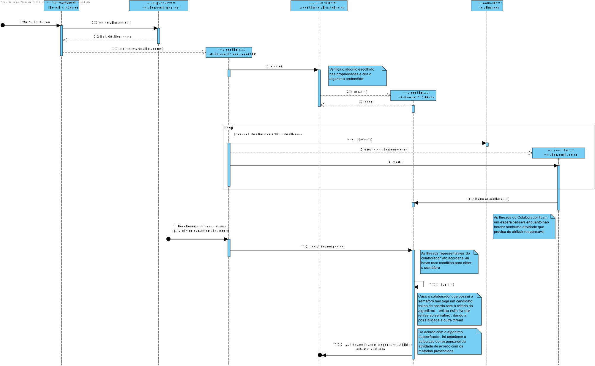

# US4072 
=======================================


# 1. Requisitos

Critérios de Aceitação:

**US4072** Como Gestor de Projeto, eu pretendo que seja desenvolvido e integrado no Motor de Fluxos de Atividades algoritmos que assignem automáticamente tarefas a colaboradores de forma a evitar que essas tarefas tenham que ser reivindicadas pelos mesmos.

Pretende-se que sejam desenvolvidos dois algoritmos distintos:

1 - baseado em First Came First Served (entre colaboradores de cada equipa);

2 - outro que, no âmbito de cada equipa, considere a quantidade de tarefas pendentes dos colaboradores e o tempo médio de execução de cada uma das tarefas (pré-definido em cada tarefa).


# 2. Análise

## 2.1. First-Came Fist-Served Algorithm

O desenvolvimento desta funcionalidade seguiu o modelo clássico de produtor/consumidor, onde o produtor é o Motor do Fluxo de Atividades e os consumidores são as várias instâncias do ColaboradorHandler.


1. O Motor de Fluxo de Atividades cria n threads do Handler do Colaborador.
2. As threads de Handler do Colaborador são colocadas em espera passiva.
3. Um pedido tem uma atividade de realização e ainda nao possui um colaborador para realizar a atividade.
4. As threads concorrem à obtenção da atividade segundo uma estratégia First-Came Fist-Served (o primeiro a chegar, será o primeiro a ser atendido).


## 2.2. Algoritmo que tem em conta a carga de trabalho do colaborador

1. O Motor de Fluxo de Atividades cria n threads do Handler do Colaborador.
2. As threads de Handler do Colaborador são colocadas em espera passiva.
3. Um pedido tem uma atividade de realização e ainda nao possui um colaborador para realizar a atividade.
4. As threads concorrem à obtenção da atividade verificando se o colaborador pertencente a thread possui a menor carga de trabalho, se este possuir a menor carga então esse colaborador ira ficar com a mesma.


# 3. Design

- **ColaboradorHandler -** Representa a thread de um Colaborador
- **AtribuicaoAtividadeAlgorithm** Inicializa as threads do Handler de Colaborador e consegue gerir as mesma
- **AlgorithmColaboratorFactory -** Factory que cria a instância do algoritmo pretendido.
- **InitiateFluxRequestV1 -** Adiciona a atividade a queue, aguarda o término da sua execução.
- **LoadBasedActivityQueque** - Classe que realiza o algoritmo que tem em conta a carga de trabalho do colaborador.
- **FCFSActivityQueque** - Classe que realiza o algoritmo de FCFS   
- **ActivityQueue -** Permite gerir os colaboradores numa queue (adicionar/remover). Caso esta esteja vazia, as threads aguardam em espera passiva a adição de uma atividade à queue. Quando uma atividade é adicionada, as threads são notificadas e a atividade que está no topo da queue é removido. quando se obtêm o colaborador pretendido.


## 3.1. Pseudocódigo

### 3.1.1. addActivity(Pedido pedido) : Classe ActivityQueue

```pseudocode
BEGIN
	ED: queue Queue<pedido>, sem SEMAPHORE , pedido Pedido
	
	queue.offer(pedido);
	sem.release()
	return true
	
END
```


### 3.1.2. run() : Classe ColaboradorHandler

```pseudocode
BEGIN
	ED: queue ActivityQueue, colab Colaborador 
	
	while true 
	do 
	    queue.handle(colab)
	end 
	
END
```

### 3.1.3. synchronized void handle(Colaborador colab) : Classe FCFSActivityQueue

```pseudocode
BEGIN
	ED: queue Queue<pedido>, sem SEMAPHORE , pedido Pedido , colab Colaborador , atividadeManual RealizacaoManual
	
	
	sem.acquire();
	pedido := queue.peek();
	if(pedido != null && pedido.verifyAcessColaborator(colab)){
	    atividadeManual:=pedido.fluxoAtividades().atividadesRealizacao();
	    atividadeManual.addResponsavel(colab);
	    save(pedido);
	    queue.poll();
	}
	
	if(!queue.isEmpty())
	    sem.release();
	
END
```


### 3.1.4. synchronized void handle(Colaborador colab) : Classe LoadBasedActivityQueue

```pseudocode
BEGIN
    ED: queue Queue<pedido>, sem SEMAPHORE , pedido Pedido , colab Colaborador , atividadeManual RealizacaoManual , fastestColaborator Boolean
      
        sem.acquire();
        pedido = queue.peek();
        IF pedido != null && pedido.verifyAccessColaborator(colab) 
            fastestColaborator:=  hasLowestWorkLoad(colab,pedido.service().catalog().teamsWithAccess());
            IF fastestColaborator 
                atividadeManual := pedido.fluxoAtividades().atividadeRealizacao();
                atividadeManual.addResponsavel(colab);
                save(pedido);
                queue.poll();
            END IF
        END IF
        IF !queue.isEmpty()
            sem.release();   
        END IF

END
```


## 3.2. Realização da Funcionalidade



## 3.3. Padrões Aplicados

* Factory
* Repository
* Strategy


# 4. Implementação


## Domain

Foi utilizado as classes de Colaborador, uma vez que estas vao representar as threads a implementar no handler do algoritmo, além de ser necessário obter as informações para ver se este é eligivel. 

## Algorithms

Neste package sao implementados as classes que fazem os algoritmos e que possui a factory para criar o algoritmo pretendido, para além de ter a classe representativa do queue. 

## Server

Foi implementado o servidor de motor de fluxo que recebe os pedidos e analisa as atividades a realizar de forma a satisfazer, o algoritmo desenvolvido entra em acao quando uma atividade de realização manual nao possui ainda um responsável para o mesmo.


# 5. Integração/Demonstração

Uma vez que este codigo é implementado para uma maquina remota , aquando de ocorrência de erros e a sua posterior correcao demorava bastante tempo para executar.
Deste forma, a integracao foi bastante dificil devido a fatores externos de dar deployement da solucao desenvolvida.

Para além disso , o facto do algoritmo ser multi-threading é mais dificil de identificar a causa de erros devido a implementacao deste conceito.

# 6. Observações

No algoritmo baseado na carga de trabalho de um colaborador foi utilizada a querie para verificar se este se encontra eligivel de forma a facilitar, sem comprometendo com a eficiência e com a ideia do que o cliente pretendia que realizassemos.


# 6.2 Estudo comparativo entre os dois algoritmos desenvolvidos

#### De forma a analisar os dois algoritmos, foram realizados testes para diferentes circunstâncias e diferentes parametros. 
 
* Num primeiro momento começamos por estudar os dois algoritmos numa situaçao para 6 colaboradores e 3 tarefas:

    * FCFS : 0.978 Segundos 
    * Work Load Based : 8.8 segundos
    
* Numa segunda ronda de testes, aumentou-se o numéro de tarefas para 20 , obtendo os seguintes resultados:
    
    * FCFS : 2.716 Segundos 
    * Work Load Based : 125.21 Segundos 
    
* Numa ultima ronda de testes, aumentou-se o numéro para 12 colaboradores ou seja duplicou-se o numéro de threads , obtendo os seguintes resultados: 
    
    * FCFS : 1.989 Segundos
    * Work Load Based : 210.79 Segundos 
    
# Análise dos resultados

 Como se pode analisar aumentando o numéro de tarefas aumenta o tempo de execucao para os dois algoritmos , no entanto uma vez que o algoritmo FCFS finaliza a atribuicao do colaborador a atividade logo que a primeira thread do colaborador tenha lock da atividade e o mesmo seja um colaborador valido para fazer a atividade.
 
Em contraste com o algoritmo de work load based necessita que todas as threads acabem e só depois é que atribui. 
Ou seja devido a espera do numéro de threads o tempo de execução irá ser maior. 

Quando se aumentou o numéro de colaboradores ou seja aumentou-se o numéro de threads , este nao afetou negativamente o algoritmo de FCFS.
Uma vez que este indepentemente do numéro de threads vai possuir o tempo de execucao similar.

Enquanto que no algoritmo de work load based , este também ira duplicar no tempo de execução devido a duplicação do numéro de threads.
Já que tal como foi explicado mencionado anteriormente este é dependente do numéro de threads porque o algoritmo espera que todas as threads acabem.


    


