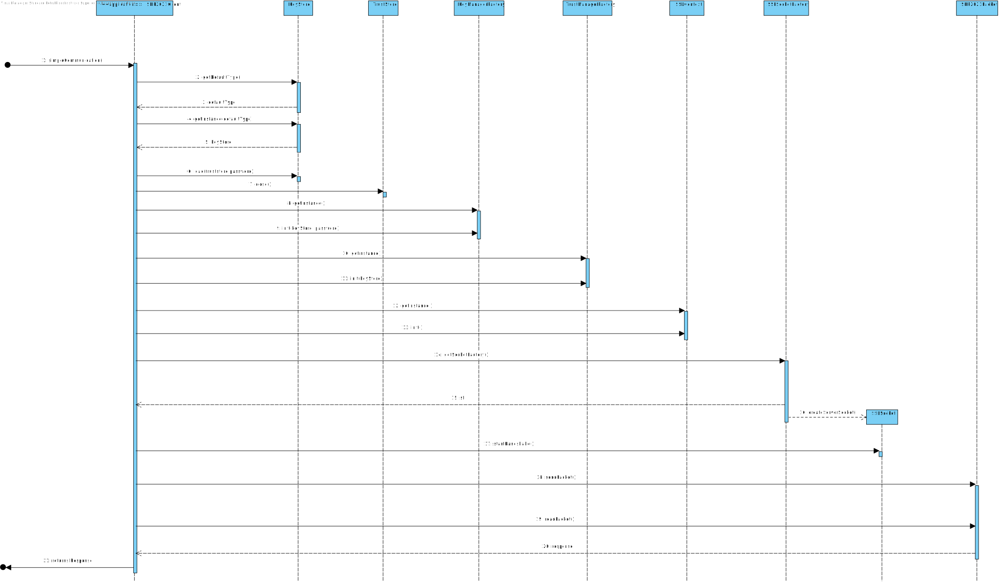
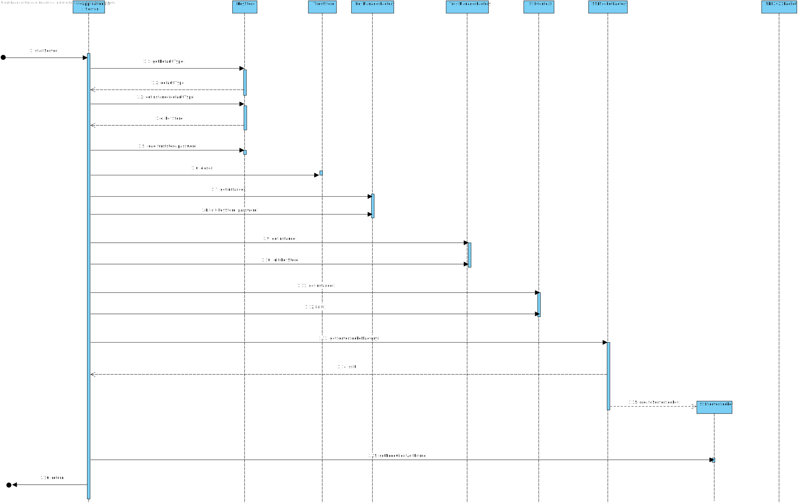

# US5002
=======================================

# 1. Requisitos

**US5002** Como Gestor de Projeto, eu pretendo que as comunicações realizadas através do protocolo SDP2021 estejam protegidas.

- Como Gestor de Projeto quando realizar comunicações através do protocolo SDP2021 então pretendo que o SSL/TLS tenha sido aplicado com autenticação mútua baseada em certificados de chave pública.

A interpretação feita deste requisito foi no sentido de que através do recurso ao SSL/TLS se pretende garantir:

* Autenticação - Garantir que terceiros não podem personificar aplicações lícitas;
* Privacidade - Garantir que terceiros não podem ler a informação;
* Integridade - Garantir que terceiros não podem modificar a informação;

Aquando da conexão do Cliente ao Servidor (e da subsequente aceitação do Cliente por parte deste).

# 2. Análise

As comunicações estabelecidas entre clientes e servidores devem usar autenticação mútua baseada em certificados de chave pública.
Visando a resolução desta funcionalidade, a proteção será garantida nas comunicações TCP através de TLS/SSL.
Para isso será necessário uma Java KeyStore (JKS) em comum, que é essencialmente um repositório de certificados de segurança. 
Neste sentido, daremos uso a bibliotecas específicas associadas a este protocolo. 
Começaremos por adicionar às propriedades do sistema os certificados que o servidor pode confiar por parte de clientes autorizados. 
De seguida, será utilizada a classe SSLServerSocketFactory e será obtida a Server Factory standard. Uma vez concluída essa etapa, será criado o socket de comunicação.
A partir deste momento qualquer tentativa de comunicação implicará autenticação.

# 3. Design

## 3.1. Realização da Funcionalidade
Por forma a representar as medidas necessárias para estabelecer comunicação entre cliente e servidor optou-se por desenvolver dois diagramas de sequência.
Um representa o comportamento do cliente e o outro o do servidor.

### Cliente

### Servidor

## 3.2. Padrões Aplicados

| Questão: Que Classe...                                       | Resposta                        | Justificação (Padrão)                                        |
| :------------------------------------------------------------: | :-------------------------------: | :------------------------------------------------------------: |
| é responsável por criar os SSLSocket? | SSLSocketFactory | Factory, quando um conceito é demasiado complexo, as fábricas fornecem encapsulamento. |

## 3.4. Testes 

**Teste 1:** Simular o envio de um packet para o Motor de Fluxo e esperar resposta

    @Test
    public void testeServidor() throws IOException {
        SDP2021Packet p=new SDP2021Packet ( 0, CODIGO_AVANCAR_FLUXO_PEDIDO,"2021/00001");
        try{
            System.out.println(SDP2021Client.simpleCommunication ( p,engineIp,enginePort, "client_mf").response());
        }catch (IOException e){
            System.out.println ("Erro no teste");
        }
    }

**Teste 2:** Simular o envio de um packet para o Executor de Atividades e esperar resposta

    @Test
    public void testeExecutor() throws IOException {
        SDP2021Packet p=new SDP2021Packet ( 0,scriptExecCode,"Script exemplo" );
        try{
            System.out.println(SDP2021Client.simpleCommunication ( p,executorIp, executorPort, "client_exec").response());
        }catch (IOException e){
            System.out.println ("Erro no teste");
        }

# 4. Implementação

A implementação desenvolvida teve por base o código fornecido no GitHub pelo regente de RCOMP. Desta forma, não influenciou a forma como a informação é enviada/recebida, apenas garante que esta troca de dados é segura.

## 4.1. Commits Relevantes

* Implementação Inicial SSL no Servidor Executor de Atividades: https://bitbucket.org/Eduardooolol/lei20_21_s4_2di_02/commits/c71d951cb1204c7ccead94aeb9467b4c8394ab55

# 5. Integração/Demonstração

Dado que todos os casos de uso de SSL/TLS estão bastante relacionados, foi necessária uma coordenação constante da equipa, por forma a desenvolver uma solução funcional e apropriada ao requerido.
Desta forma, todas as modificações foram implementadas em conjunto, tendo havido especial atenção na implementação relativa ao SDP2021Client dado esta classe servir como Cliente para qualquer um dos servidores.

# 6. Observações

