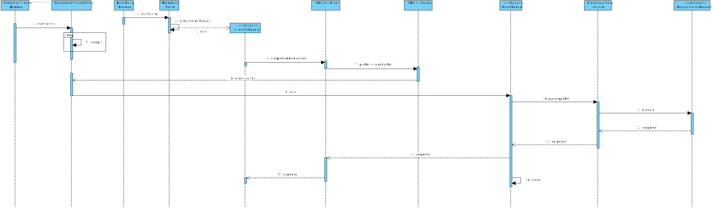

# US5003
=======================================


# 1. Requisitos

**US5003**  Como Gestor de Projeto, eu pretendo que a equipa conclua o desenvolvimento do Executor de Tarefas Automáticas tornando-o bastante robusto.

-  Dado que sou Gestor de Projeto quando executar o Executor de Tarefas Automáticas então pretendo que as expressões da linguagem/gramática desenvolvida sejam executadas/interpretadas (e.g. script de tarefa automática)

A interpretação feita deste requisito foi no sentido de que se pretende finalizar o desenvolvimento da `US5001` do Sprint C.

# 2. Análise

Em adição às funcionalidades anteriormente desenvolvidas no âmbito da `US5001` do Sprint C:

- Garantir a transação de dados entre as diferentes aplicações do Sistema;
- Simular a execução de Tarefas/Atividades Automáticas.

Pretende-se agora no âmbito da US5003:

- Permitir a execução das Tarefas/Atividades Automáticas com recurso à gramática/linguagem desenvolvida;
- Efetuar as modificações necessárias para tornar o Executor de Tarefas Automáticas bastante robusto.

# 3. Design

## 3.1. Realização da Funcionalidade

À semelhança do desenvolvido no Sprint anterior, o Executor de Atividades Automáticas mantém as suas funções de Servidor cujo cliente será o Motor de Fluxo de Atividades. Contudo, no presente Sprint existem, em adição ao US5003, dois casos de uso que implicam modificações nalguns detalhes desta relação, nomeadamente US5002 e US 4071. Assim, destacam-se as seguintes funcionalidades que explicita ou implicitamente estarão descritos no Diagrama de Sequência (e melhor detalhados nos respetivos ficheiros .md) e que contudo, não advêm diretamente de uma melhoria da prévia implementação mas implicam novas funcionalidades:

- O Motor de Fluxo de Atividades assume agora a responsabilidade de criar Threads do Executor de Atividades Automáticas, por forma a que vários Scripts possam ser enviados para o Executor e nas diferentes threads do mesmo se possa proceder à execução concorrente dos vários scripts;
- Todas as comunicações TCP segundo o protocolo SDP2021 encontram-se protegidas pela aplicação do SSL/TLS.




## 3.2. Padrões Aplicados

| Questão: Que Classe...                                       | Resposta                        | Justificação (Padrão)                                        |
| ------------------------------------------------------------ | ------------------------------- | ------------------------------------------------------------ |
| é responsável por criar os diferentes tipos de BaseAtividadeRequest? | ExecutarAtividadeRequestFactory | Factory, quando um conceito é demasiado complexo, as fábricas fornecem encapsulamento. |
| é responsável por tratar as diversas alternativas comportamentais de Classes representativas de Request? | BaseAtividadeRequest | Polimorfismo, na classe abstrata BaseAtividadeRequest constrói-se o método abstrato execute() que assume diferentes funcionalidades consoante a subclasse que implementa o método. |

Adicionalmente, para o desenvolvimento das diversas classes de Request seguiram o princípio Open-Closed, uma classe deve ser aberta (open) para extensão mas fechada (close) para modificação, tal como acontece para a hierarquia de classes de Request (no package protocol).

## 3.3. Testes 

**Teste 1:** Permite iniciar uma thread de executor, executando o script associado ao pedido 2021/00001

```java
@Test
public void testeExecucaoScriptPeloMotor1() {
    String requestId="2021/00001";
    SDP2021Packet p=new SDP2021Packet ( version,scriptExecCode, requestId);
    try{
        SDP2021Packet result=SDP2021Client.simpleCommunication ( p,engineIp,enginePort, cert);
        System.out.println (result.response ());
    }catch (IOException e){
        System.out.println ("(testeExecucaoScriptPeloMotor1)Erro");
        e.printStackTrace ();
    }
}
```

## 3.4. Melhorias Realizadas

- Adição do método que garante a execução do Script
- Desenvolvimento de classes representativas dos diferentes Requests
- Adaptação para permitir diferentes versões de Requests

# 4. Implementação

## Protocol 
Dado que o Executor de Atividades Automáticas não comunica diretamente com a Base de Dados, o package Protocol assume maior preponderância.
Destaca-se, para este Sprint, a classe `ExecutarAtividadeRequestFactory`, que cria os diferentes Requests de Atividade consoante a versão pretendida e as classes `BaseAtividadeRequest` e `BaseErrorRequest` e subclasses que constituem uma aplicação do princípio open-closed.


# 5. Integração/Demonstração

Dado que todos os elementos estavam envolvidos na componente de estabelecer comunicações cliente-servidor, e considerando que 
os servidores de Executor e Motor já se encontravam alocados nos SSH, foi necessário um esforço coletivo para podermos executar e testar todas as funcionalidades.

# 6. Observações

