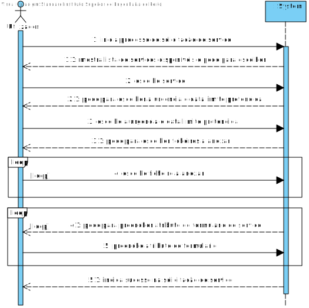
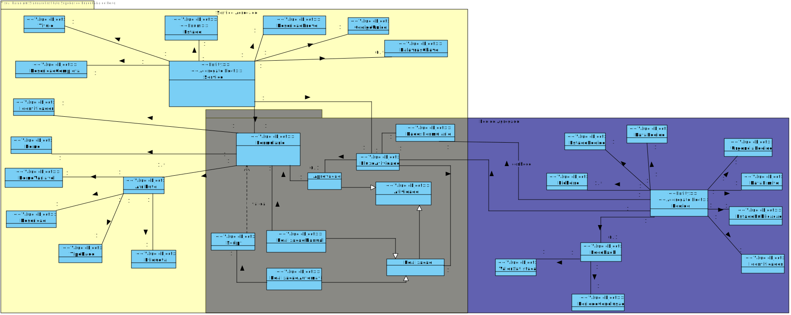
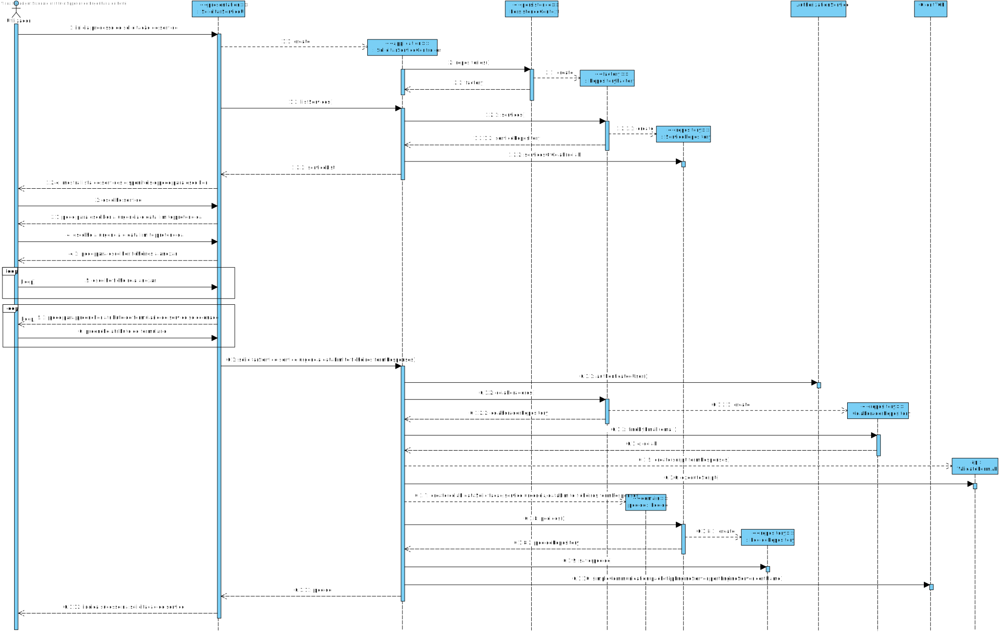
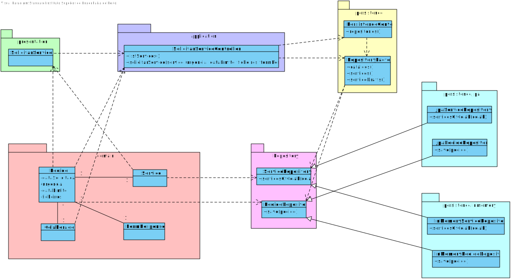

# US3003
=======================================

# 1. Requisitos

**US3003** Como utilizador, eu pretendo solicitar um serviço do catálogo de serviços que me é disponibilizado.

#### Melhorias realizadas neste sprint:
* Ligação ao motor de fluxo
* Validação do formulário, segundo a respetiva linguagem

# 2. Análise

## 2.1. SSD

## 2.2. Excerto do modelo de domínio

# 3. Design

*Nesta secção a equipa deve descrever o design adotado para satisfazer a funcionalidade. Entre outros, a equipa deve apresentar diagrama(s) de realização da funcionalidade, diagrama(s) de classes, identificação de padrões aplicados e quais foram os principais testes especificados para validar a funcionalidade.*

*Para além das secções sugeridas, podem ser incluídas outras.*

## 3.1. Realização da Funcionalidade

## 3.2. Diagrama de Classes

## 3.3. Padrões Aplicados

*Nesta secção deve apresentar e explicar quais e como foram os padrões de design aplicados e as melhores práticas.*

Questão: Que Classe...|Resposta|Justificação (Padrão)|
|:----:|:---------------:|:-----:|
|é responsável por criar todos as classes Repository?|RepositoryFactory|Factory, quando uma entidade é demasiado complexa, as fábricas fornecem encapsulamento.|
|conhece todos os serviços?|ServiceRepository|Information Expert, dado que é responsável pela persistência/reconstrução de Service, conhece todos os seus detalhes.|
|permite guardar o pedido?|PedidoRepository|Information Expert, dado que é responsável pela persistência/reconstrução de Pedido, conhece todos os seus detalhes.|
| é reponsável por coordenar o caso de uso? | SolicitarServicoController | Controller, dado que funciona como intermediário entre as camadas de Domínio e as de Apresentação|

## 3.4. Testes 
*Nesta secção deve sistematizar como os testes foram concebidos para permitir uma correta aferição da satisfação dos requisitos.*

Foram desenvolvidos testes para validar que na classe Pedido não são recebidos parametros nulos.

**Teste 1:** Verificar que não é possível criar uma instância da classe Pedido com valores nulos.

	@Test(expected = IllegalArgumentException.class)
    public  void  ensureNullsIsNotAllowed(){ 
        Pedido fx = new Pedido(null,null,null,null,null,null,null,null,null,null);
    }

# 4. Implementação

## Domain

Foram criadas na camada de domínio a entidade Pedido e os respetivos Value Objects.

## Application

Nesta camada foi desenvolvido o Controller de solicitação de serviço

## Repository

Na camada de repository foi implementada a interface PedidoRepository, que é depois implementada em JPA e InMemory no módulo de impl.

## Presentation

Nesta camada foi desenvolvida a UI (consola) que faz a interação com o utilizador do sistema para solicitação do serviço (criação do pedido).

# 5. Integração/Demonstração

Foi necessária integração com funcionalidades de Serviço, Colaborador, Atividade e Formulário.

# 6. Observações

Possível melhoria a implementar: uso de DTO.
