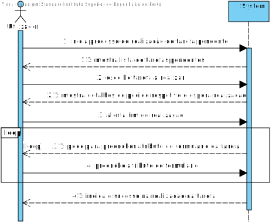
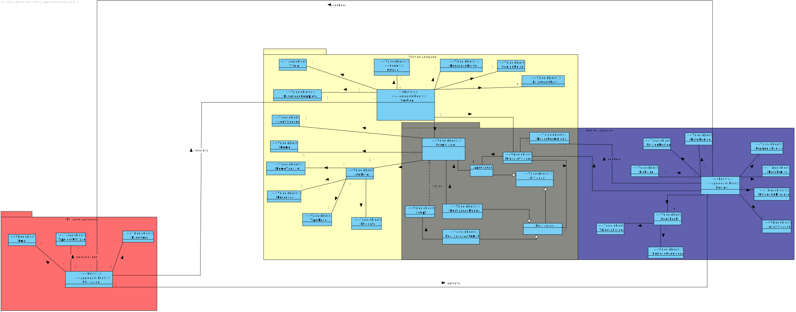
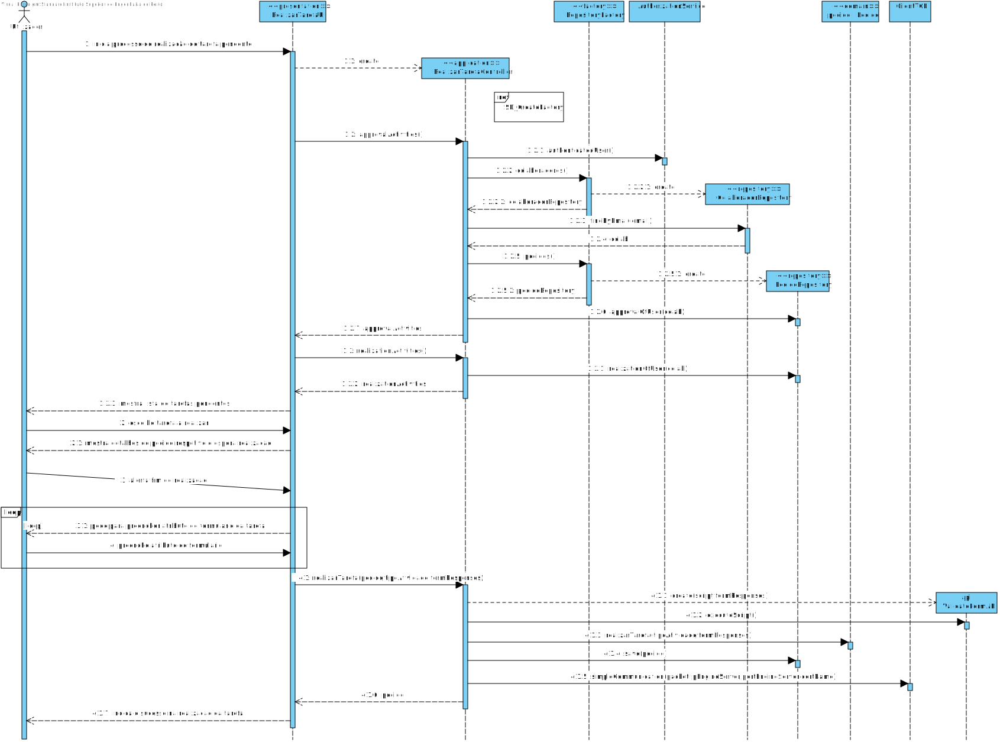
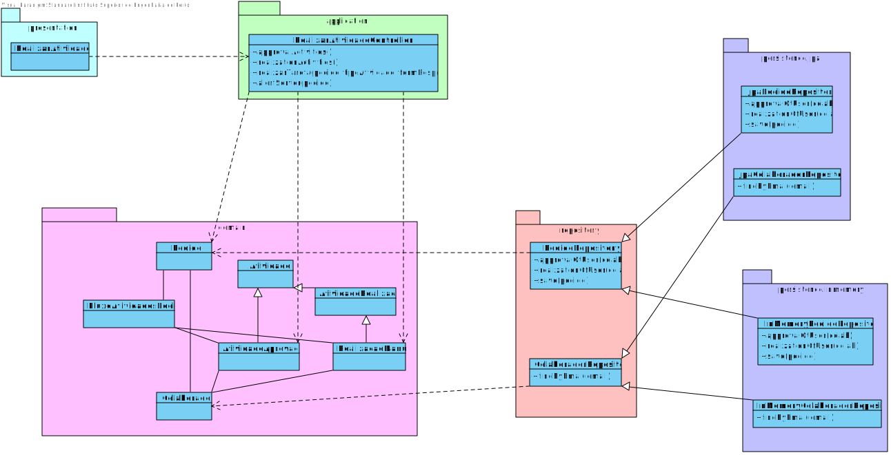

# US3023
=======================================

# 1. Requisitos

**US3023** Como utilizador, eu pretendo realizar uma tarefa que tenho como pendente.

# 2. Análise

## 2.1. SSD

## 2.2. Excerto do modelo de domínio

# 3. Design

*Nesta secção a equipa deve descrever o design adotado para satisfazer a funcionalidade. Entre outros, a equipa deve apresentar diagrama(s) de realização da funcionalidade, diagrama(s) de classes, identificação de padrões aplicados e quais foram os principais testes especificados para validar a funcionalidade.*

*Para além das secções sugeridas, podem ser incluídas outras.*

## 3.1. Realização da Funcionalidade

## 3.2. Diagrama de Classes

## 3.3. Padrões Aplicados

*Nesta secção deve apresentar e explicar quais e como foram os padrões de design aplicados e as melhores práticas.*

Questão: Que Classe...|Resposta|Justificação (Padrão)|
|:----:|:---------------:|:-----:|
|é responsável por criar todos as classes Repository?|RepositoryFactory|Factory, quando uma entidade é demasiado complexa, as fábricas fornecem encapsulamento.|
|conhece todos os pedidos e suas atividades?|PedidoRepository|Information Expert, dado que é responsável pela persistência/reconstrução de Pedido, conhece todos os seus detalhes.|
| é reponsável por coordenar o caso de uso? | RealizarAtividadeController | Controller, dado que funciona como intermediário entre as camadas de Domínio e as de Apresentação|

# 4. Implementação

É possível verificar a divisão das responsabilidades pelas diferentes camadas (nomeadamente Domain, Application, Repository e Presentation).

As informações do servidor de motor de fluxo são obtidas a partir do ficheiro de configurações.

# 5. Integração/Demonstração

Foi necessário integrar esta funcionalidade em conjunto com o server de motor de fluxo e a linguagem de validação de formulário.

# 6. Observações

Possível melhoria: passar implementação da comunicação com o server para um serviço.