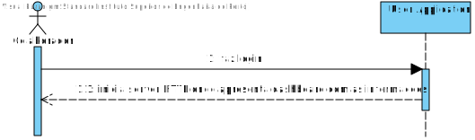
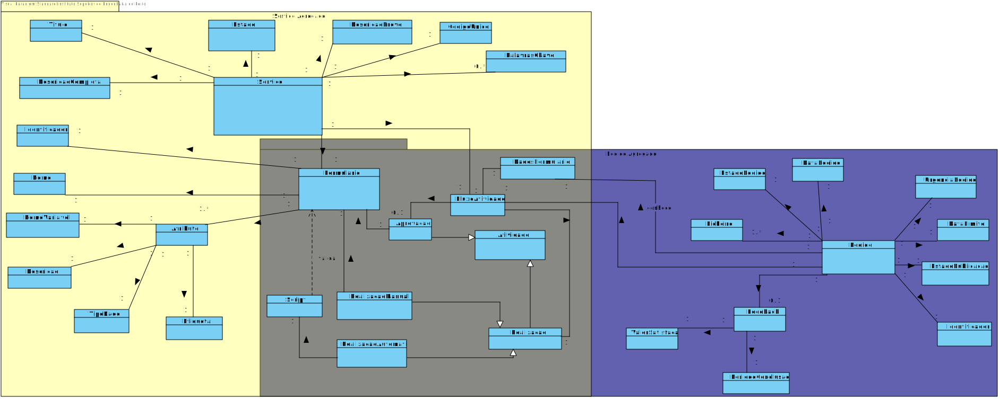
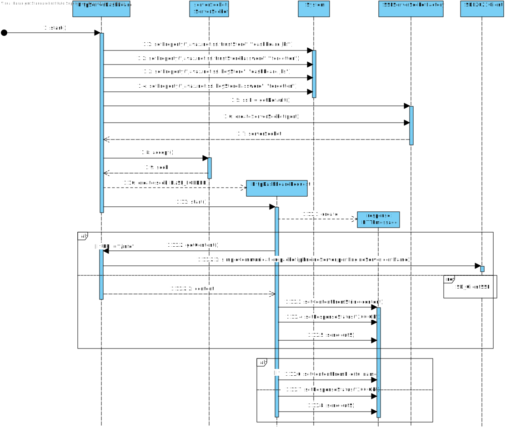
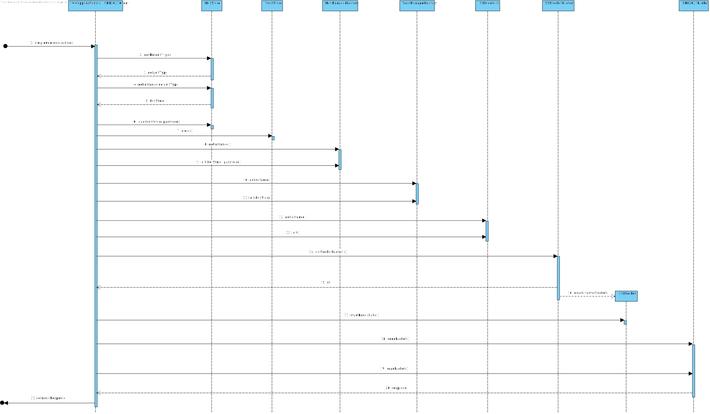
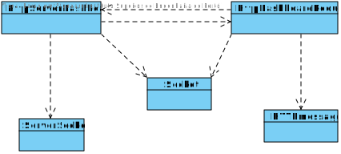

# US3101
=======================================

# 1. Requisitos

**US3101** Como Gestor de Projeto, eu pretendo que as comunicações realizadas através do protocolo SDP2021 estejam protegidas.

# 2. Análise

## 2.1. SSD

## 2.2. Excerto do modelo de domínio

# 3. Design

*Nesta secção a equipa deve descrever o design adotado para satisfazer a funcionalidade. Entre outros, a equipa deve apresentar diagrama(s) de realização da funcionalidade, diagrama(s) de classes, identificação de padrões aplicados e quais foram os principais testes especificados para validar a funcionalidade.*

*Para além das secções sugeridas, podem ser incluídas outras.*

## 3.1. Realização da Funcionalidade

## 3.2. Diagrama de Classes

# 4. Implementação

A classe HttpServerDashboard é responsável por abrir o ServerSocket e esperar pelos clients. A classe HttpDashboardRequest (thread) é iniciada para cada client e é responsável por fornecer tanto a página HTML (mais CSS e JavaScript) como fornecer as informações para a dashboard, quando é enviada uma request "/info". É implementado AJAX através de Javascript de forma a que o conteúdo da página recarregue automaticamente.

Neste sprint, foi adicionado o suporte a SSL, de forma a estar implementado HTTPS. É usado um certificado dashboard.jks, self generated.

# 5. Integração/Demonstração

Para ser desenvolvida, foi necessário integração direta com a US4002, que era responsável por obter as informações a mostrar na Dashboard através do server TCP de motor de fluxo, segundo o protocolo definido SDP2021.

Foi também implementado SSL para funcionar essa comunicação com o server TCP de motor de fluxo.

# 6. Observações

Possível melhoria: separar o style (CSS) e script (Javascript) do ficheiro de HTML.